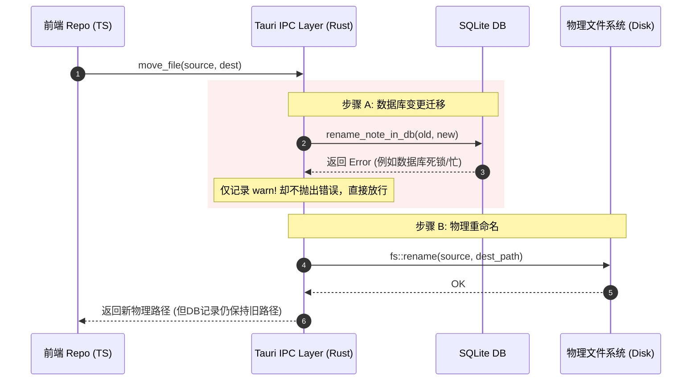
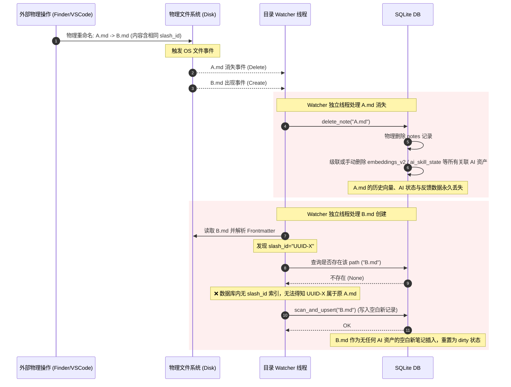

# Slash Desktop 基础功能架构审计与代码 Review 报告

本报告对 Slash Desktop 客户端的基础功能（仓库切换与初始化、目录/笔记 CRUD 及重命名、移动等）进行了深度架构审计与代码清洁度检查。审计的核心文件包括后端 `apps/desktop/src-tauri/src/commands/fs.rs`、`apps/desktop/src-tauri/src/commands/db.rs`、`apps/desktop/src-tauri/src/core/watcher/mod.rs` 以及前端 `apps/desktop/src/core/storage/FileSystemNoteRepository.ts`。

此外，本报告特别针对近期引入的 **UUID-First 架构转型** 在本地客户端的落地完整性，以及物理文件变动（Watcher 监听机制）与本地 SQLite 数据库中的 UUID (`slash_id`) 映射状态机在重命名/移动时的竞态条件（Race Condition）进行了专项评估。

---

## 一、 模块化与抽象层次评估

经过对 Tauri IPC 命令（Interface 层）与后端核心 Service/Repository（Core 层）之间的交互分析，我们发现了以下几个核心设计问题：

### 1. 职责划分不清与业务逻辑下沉 (Architecture Leak)
在 `apps/desktop/src-tauri/src/commands/mod.rs` 中，明确声明了该模块的设计规范：
> *"Business logic should NOT be in this layer." (业务逻辑不应存在于本层)*

然而实际代码中，大量复杂的业务逻辑直接堆砌在 Tauri Command 接口函数中：
*   **硬编码过滤与路径计算**：`fs.rs` 中的 `PROTECTED_ROOT_DIRS`（受保护的系统目录）和 `is_protected_root_dir` 判定逻辑被直接编写在命令层，限制了其在非 IPC 场景（如 CLI 工具、同步服务）下的复用。
*   **庞大的扫描与构建逻辑**：`db.rs` 中的 `scan_vault` 与 `rebuild_from_files` Command 函数内部，直接负责了使用 `WalkDir` 递归遍历磁盘目录、过滤隐藏文件、解析前缀并在数据库中分 Phase 进行 `upsert` 和 `delete` 的全套逻辑。这些理应由专门的 `SyncService` 或 `VaultManager` 来承载。

### 2. 重复的物理与数据库操作链 (Double-Track Implementation)
在重命名和移动笔记时，前端与后端呈现出了相互重叠的实现链路，增加了维护成本并易诱发状态不一致：
*   **前端逻辑**：`FileSystemNoteRepository.ts` 的 `renameNote` 方法中手动处理了：`rename_note_in_db` (IPC) $\rightarrow$ 物理重命名文件 $\rightarrow$ 读取新文件内容并用正规序列化方式更新 YAML 中的 title。
*   **后端逻辑**：`fs.rs` 中的 `move_file` 命令也独立执行了相似的操作：`rename_note_in_db` (DB 事务) $\rightarrow$ 调用 `fs::rename` 物理移动文件。
*   **混乱的入口**：侧边栏的拖拽和常规移动使用了后端的 `move_file`，而其他存储组件则直接调用了前端的 `renameNote`，导致物理文件移动与数据库同步动作拥有多套不同控制强度的入口。

### 3. 错误处理机制不够类型安全与健壮
*   **泛化 String 传递**：后端 IPC 命令中几乎全部采用 `Result<T, String>` 返回值，并在遇到内部 Rust 错误（如 `rusqlite::Error`、`std::io::Error`）时采用极具侵入性的 `.map_err(|e| e.to_string())` 泛化为文本。这种设计在遇到“磁盘已满”、“权限受限”、“数据库锁定”等特定异常时，前端无法进行结构化识别和精细化的 UI 引导或重试策略。
*   **不一致性妥协**：在后端的 `move_file` Command 中（第 271 行），当遇到 `rename_note_in_db` 失败时，代码只进行了 `log::warn!` 记录，**继续强行执行了物理文件移动**。这属于灾难性设计：如果数据库迁移失败，但物理文件却成功到了新路径，系统的一致性将被彻底打破（下文将详细阐述其诱发的 Bug）。



---

## 二、 文件与数据库一致性设计及 Race Condition 评估

物理文件系统变动（被 `Watcher` 监听）与 SQLite 本地数据更新之间依靠 Debounce 延迟消息进行协同。在这种设计下，存在以下一致性与数据丢失风险：

### 1. 文件夹移动/重命名导致的数据彻底清洗灾难 (核心漏洞 🚨)
> [!CAUTION]
> 这是系统当前最严重的隐患。重命名或移动文件夹将导致该文件夹下的所有笔记的 AI 元数据、链接关系、任务提取历史彻底被清空。

当用户重命名文件夹（例如将 `A/` 重命名为 `B/`）时，执行过程及漏洞成因如下：
1.  **文件级忽略**：后端的 `move_file` 在检测到源路径不是以 `.md` 结尾（对于目录，此条件为真）时，**完全不会触发数据库层面的任何更新**，它会直接通过 `fs::rename` 进行物理路径转换。
2.  **Watcher 被动感知**：物理移动完成后，Watcher 在 200ms 的 debounce 后接收到了底层文件变动。由于操作系统底层的 `notify` 事件特点以及 debouncer 的合并策略，Watcher 会收到两个方向的变动：
    *   **旧路径 `A/` 丢失**：Watcher 执行 `!path.exists()` 判定，判定该目录已被删除。它会获取相对于 vault 的路径 `A`，并直接在数据库中执行：
        ```sql
        DELETE FROM notes WHERE path LIKE 'A/%';
        ```
        由于 `links` (WikiLink) 和 `tasks` 表在外键中声明了 `ON DELETE CASCADE`，这会导致原目录下所有笔记的**核心链接结构、物理任务状态在数据库中被直接抹去**。同时，其他的关联信息（如 `embeddings_v2`、`ai_skill_state`、`ai_metadata`、`classification_cache`）也会被 `delete_note` 调用手动清除。
    *   **新路径 `B/` 出现**：Watcher 判定新路径为目录，执行 `walkdir_md_files(B/)`，扫描出其中的所有 `.md` 文件。
    *   **重新 upsert 写入空白记录**：Watcher 对这些文件逐个执行 `scan_and_upsert`。因为数据库中关于这些笔记的旧记录已在第一步中被强行 `DELETE`，这批笔记对于数据库而言会被判定为**全新写入的笔记**。
3.  **最终后果**：该文件夹下的所有笔记在数据库中被重置为“新创建”状态。**用户以前的所有 AI 摘要、AI 标签、手动确认 of user_tags/user_summary（若未写入 yaml）、向量特征数据（Embeddings 向量）及与其他笔记的 WikiLinks 反向关联网络彻底丢失，必须重新消耗巨大的算力生成！**

### 2. 笔记重命名失败下的 Watcher 竞态
当重命名笔记文件时，若 `rename_note_in_db` 抛出错误（例如数据库写锁冲突），而 `move_file` 放行并完成了 `fs::rename`：
1.  物理上，旧文件 `A.md` 变成了 `B.md`。
2.  Watcher 捕获到 `A.md` 丢失事件，因数据库中 `A.md` 依然残留，Watcher 认为物理文件已被用户在外部彻底删除，进而调用 `delete_note(conn, "A.md")` 清空了 `A.md` 的所有数据库元数据与缓存。
3.  Watcher 捕获到 `B.md` 创建事件，发现数据库中没有 `B.md`，执行 `scan_and_upsert`，以全新空白笔记的表项重新写入 `B.md`。
4.  这同样导致了该笔记所有历史 AI 状态和关联数据的丢失。

---

## 三、 UUID-First 架构转型及本地-同步分层分裂评估

主 Agent 近期在系统层面推行了 **UUID-First 架构转型**，但目前该改造在本地客户端呈现出明显的**“两层皮”**分裂状态，对数据一致性和多端同步安全性带来了严重的隐患：

### 1. 同步协商层与本地存储层的标识分裂
*   **同步协议层（云端 & 客户端同步模块）**：已经 100% 贯彻了以 UUID 作为文件唯一身份标识（`file_id`）的策略。通过在 YAML Frontmatter 中写入 `slash_id: "<UUID>"`，同步组件如 `personal.rs` 和 `team.rs` 能够极其稳定地感知重命名和位置迁移。
*   **同步删除的 UUID 安全校验 (BUG-SYNC-01)**：
    在 `personal.rs` (第 270-284 行) 和 `team.rs` (第 540-554 行) 中，在删除本地文件前，会先读取本地文件内容并通过 `extract_slash_id_str` 提取 UUID，只有当本地 UUID 存在且与服务器下发的 expected UUID 一致时才执行物理删除。这确实有效地防止了因同步延迟误删被复活的新近同名文件的隐患。
*   **本地存储层的“盲目”**：
    与同步层的严格 UUID 校验相比，本地 SQLite 存储和 Watcher 对 `slash_id` 呈现出完全的“盲目”：
    *   在 `schema.sql` 中，`notes` 表依然以物理 `path` 路径作为主键与唯一约束，数据库没有为 `slash_id` 引入任何存储列或唯一性约束索引。
    *   在 `scanner.rs` 的 `parse_frontmatter` 逻辑中，虽然解析了 `title`、`tags` 等，但却对 Frontmatter 中的 `slash_id` (即 `file_id`) **选择性忽略**。
    *   这使得本地数据库成了一个基于路径的“物理孤岛”，根本无法通过 UUID 判定任意两个物理路径之间的逻辑关联。

### 2. 同步-监听级联清洗灾难 (Sync-Watcher Cascade Wipeout) 🚨
由于本地数据库与 Watcher 缺乏对 `slash_id` 映射机制的实现，导致多端同步在处理跨设备重命名和路径变更时，会在本地引发严重的“级联大清洗”：

*   **跨设备重命名在同步层下的行为**：
    假设设备 A 将 `01_Projects/ProjA.md` (UUID 为 `UUID-X`) 重命名为 `01_Projects/ProjB.md` 并同步至云端。
    设备 B 触发同步周期后，同步协商结果为：`01_Projects/ProjA.md` 为 `server_deleted`，`01_Projects/ProjB.md` 为 `client_needs`。
*   **物理操作序列**：
    1.  设备 B 同步层先处理 `server_deleted`：读取物理文件 `01_Projects/ProjA.md`，通过 `BUG-SYNC-01` 的 UUID 校验一致后，**物理删除** `ProjA.md`。
    2.  设备 B 同步层再处理 `client_needs`：从云端拉取新版，并将文件**物理写入**新路径 `01_Projects/ProjB.md`。
*   **Watcher 被动感知并误杀**：
    上述物理文件系统的删除和创建动作，对于后台的 Watcher 线程来说，纯属普通的外部文件变更事件：
    1.  **处理 `ProjA.md` 消失事件**：Watcher 捕获到 `ProjA.md` 丢失。由于本地 SQLite 没有 `slash_id` 主索引，Watcher 只能将其作为“用户手动删除了物理文件”处理，调用 `delete_note("01_Projects/ProjA.md")`。
    2.  **级联抹除 AI 元数据**：由于级联外键约束，SQLite 迅速将 `ProjA.md` 对应的所有本地 AI 摘要、WikiLinks 反向关系、用户标签反馈以及向量特征 (`embeddings_v2`、`ai_skill_state`）**全部从数据库中永久物理抹去**。
    3.  **处理 `ProjB.md` 新建事件**：Watcher 捕获到 `ProjB.md` 出现，执行 `scan_and_upsert("ProjB.md")`。因为本地数据库在删除旧文件和新建新文件时没有任何 UUID 碰缘判断，`ProjB.md` 被当成一篇**全新写入的空白笔记**录入。
*   **最终后果**：
    多端同步引起的路径变更，不仅没有在本地实现 AI 状态的平移，反而因为物理文件变动触发了本地 Watcher 机制，导致本地辛苦跑完的所有 AI 资产遭到**一并抹杀、清空并重置为待处理脏状态**。

下图展示了由于缺乏本地 UUID 映射，跨设备同步路径变更或外部重命名操作在 Watcher 驱动下导致 AI 关联资产丢失的整个生命周期：



---

## 四、 扩展性、代码整洁度与技术债

### 1. 全库 WalkDir 磁盘扫描（严重的性能黑洞 ⚠️）
在审计过程中，我们发现了两段极其冗余且消耗极高 I/O 资源的诊断逻辑：

*   **后端 `fs.rs`**（`move_to_trash` 第 75-132 行）：
    当用户在客户端中删除一个 `.md` 文件时，为了在控制台打印一段关于 Orphan Asset（孤儿附件）的 `log::debug!` 诊断信息，后端每次都会**通过 WalkDir 遍历整个 Vault 的所有目录**，读取所有 md 文件，并逐一提取图片引用来计算引用计数！对于中大型知识库（上千个文件），每删一次笔记就会导致一次极高的磁盘 I/O 峰值。并且，这个诊断计算除了打印 debug 日志外，**对业务逻辑没有任何实际贡献**。
*   **前端 `FileSystemNoteRepository.ts`**（`deleteNote` 后调用的 `_verifyAndCleanOrphanAssets` 第 368-428 行）：
    极其惊人的是，在删除文件后，前端 JavaScript 异步逻辑中，**也手写了一套一模一样的逻辑**！它通过 `@tauri-apps/plugin-fs` 的 `readDir` 递归遍历整个 Vault 的磁盘目录，然后调用 `readTextFile` 把所有 `.md` 文件的内容都读进内存，检索是否包含该附件名。
*   **架构性能黑洞**：
    1.  **双重扫描**：删除一篇笔记，前端和后端分别独立发起了一次对物理磁盘中整个 Vault 的全量 WalkDir 与文件读取。
    2.  **放弃数据库**：数据库的 `links` 表本身就已经在写入/修改时通过扫描器保存了完整的关系树。查询一个资产是否还有人在引用，原本只需要执行一次极低开销的 SQL 语句：
        ```sql
        SELECT COUNT(*) FROM links WHERE target_path = 'assets/xxx.png';
        ```
        但由于架构分层未协同，前后端均抛弃了快速的数据库查询，反而选择以最粗糙的方式，让单线程的 JS 和后台进程分别对磁盘文件系统做高昂的重复线性扫描。这在生产环境中会随着文件规模增长带来严重的客户端无响应。

### 2. 重复的 PARA 系统文件夹定义 (Code Smell)
*   `commands/fs.rs` 中硬编码了 `PROTECTED_ROOT_DIRS`，用于拦截非法删除操作。
*   `commands/db.rs` 中硬编码了 `PARA_FOLDERS`，用于初始化创建。
*   这种核心的系统规则散落在不同的文件里，属于不良的硬编码债务。一旦未来需要扩展资产文件夹或增加新的系统目录，开发人员必须在前后端多处进行手动同步修改，极易造成逻辑断裂。

---

## 五、 重构与优化建议 (Implementation Plan)

为彻底解决一致性漏洞、提高系统在高并发与大数据量下的响应速度，并真正促成 UUID-First 架构在客户端的完整落地，我们建议针对基础文件与数据库交互层进行如下重构：

### 1. 完善本地 UUID 映射及 Watcher 智能映射重构 (核心重构点 ✨)
彻底终结 Watcher 在重命名时的 `DELETE + INSERT` 噩梦，引入基于 UUID 的双向映射：

*   **步骤 A：数据库 Schema 升级**
    *   在 `schema.sql` 的 `notes` 表中增加 `slash_id TEXT UNIQUE` 列。
    *   建立索引：`CREATE INDEX idx_notes_slash_id ON notes(slash_id)`。
*   **步骤 B：Scanner 解析与写入升级**
    *   在 `scanner.rs` 的 `parse_frontmatter` 中，增加对 `slash_id` 的提取（与同步层的提取规则对齐）。
    *   在 `notes.rs` 的 `upsert_note` 中，将解析到的 `slash_id` 写入对应的列中。
*   **步骤 C：Watcher 碰缘重映射状态机 (Race Shielding)**
    *   在 `watcher/mod.rs` 捕获到新物理文件 `B.md` 创建时，首先执行 `scan_file`。
    *   提取出 `B.md` 物理文件中的 `slash_id`（假设为 `UUID-X`）。
    *   执行数据库检索：`SELECT path FROM notes WHERE slash_id = 'UUID-X'`。
    *   **条件判定与重映射**：
        1.  若找到匹配记录，且对应路径为 `A.md`（与 `B.md` 不同）：
            *   证明当前事件为重命名或移动，立即在同一个数据库连接中执行原子级的 `rename_note_in_db(conn, "A.md", "B.md")`！
            *   此时，`A.md` 对应的所有本地 AI 缓存、反馈、Embeddings 完美平移至 `B.md`。
        2.  若找到匹配记录，且路径就是 `B.md`：
            *   说明文件仅被修改，无需迁移，正常执行内容更新的 `upsert` 即可。
        3.  若未找到任何匹配记录：
            *   判定为真正的全新文件，正常写入数据库并标记为 AI Dirty。
    *   **删除事件的安全拦截**：
        *   当 Watcher 随后（或此前）捕获到 `A.md` 物理消失的事件时，去数据库中检索 `A.md` 路径下的 `slash_id` 是否还是这个 `UUID-X`。
        *   若发现该路径记录已被上一步的重映射逻辑迁移为 `B.md`（数据库里 `A.md` 记录已自然不复存在），则**静默跳过删除动作**，防止 Watcher 的被动删除误杀迁移好的 AI 资产。
*   **步骤 D：同步期间的 Watcher 静默防护（Watcher Silencing）**
    *   **痛点**：多端同步层在执行 `sync_vault` 期间会产生密集的物理 IO（Pull 拉取写入新文件、Delete 删除旧文件）。这会给后台的 Watcher 派发海量的事件，如果此时 Watcher 还要频繁去读文件、查 DB 映射，甚至执行冗余的 `scan_and_upsert`，将造成严重的 CPU 抖动和数据库忙死锁。
    *   **建议**：
        1. 在 `DbState` 或 `SessionState` 中维护一个全局原子布尔值 `is_syncing`（或为 Watcher 引入 `Pause`/`Resume` 通道）。
        2. 同步开始时将该值置为 `true`。Watcher 线程接收到文件系统事件后，首先检查 `is_syncing` 标志，若为 `true` 则直接静默忽略这些事件，不再触发扫描、upsert、删除或 `vault:refresh` 事件。
        3. 同步完成后，由同步模块将 `is_syncing` 置为 `false`，并显式调用一次 `vault:refresh` 刷新状态。在同步期间所有的数据库状态变更已由同步模块通过事务写入 SQLite 数据库，因此无需被动 Watcher 盲目地进行二次增量更新，这从源头上斩断了同步物理 IO 与被动监听之间的“级联清洗竞争”。

### 2. 抽取核心重构服务 (Introduce Refactoring Service)
将分散在前端 (`FileSystemNoteRepository.ts`) 以及 Tauri IPC Command (`fs.rs`, `db.rs`) 中的业务逻辑统一剥离。在 Rust 后端引入一个专门的 `RefactorService`，负责高阶文件事务：

```rust
pub struct RefactorService;

impl RefactorService {
    /// 原子级重命名/移动笔记文件，由 DB 事务与物理操作统一包装
    pub fn rename_note(conn: &mut Connection, old_path: &Path, new_path: &Path) -> Result<(), AppError> { ... }
    
    /// 原子级重命名/移动目录，并在 DB 中以事务批量更新前缀，避免 Watcher 大清洗
    pub fn rename_folder(conn: &mut Connection, old_dir: &Path, new_dir: &Path) -> Result<(), AppError> { ... }
}
```

*   **解决目录移动/重命名的洗牌**：
    在 `RefactorService::rename_folder` 中，应通过 SQLite 事务，暂时将 `PRAGMA foreign_keys = OFF`。随后，在同一个数据库连接中执行批量路径替换，将 `notes.path`、`links.source_path` / `links.target_path`、`embeddings_v2.note_path` 中所有前缀为 `old_dir/` 的记录更新为 `new_dir/`，规避 Watcher 的暴力删除。

### 3. 彻底移除全量磁盘扫描，利用 DB 解析关系
*   **彻底清理后端无用的 debug 代码**：直接删除 `fs.rs` 的 `move_to_trash` 命令中 75-132 行的 walkdir 引用计数逻辑，消除每次删除文件引起的后台磁盘狂转。
*   **改造前端的资源清理**：将 `FileSystemNoteRepository.ts` 中的 `_verifyAndCleanOrphanAssets` 文件扫描完全移除。应当使用后端现有的 `links` 表进行过滤，如果判定资产没有被任何 `links` 指向，则执行清理。

### 4. 规范错误处理
*   定义强类型的错误枚举 `AppError`（使用 `thiserror` 或 `failure` 库），并实现 `serde::Serialize` 以便能把细分错误码（例如 `DatabaseLocked`、`PathPermissionDenied`、`SystemFolderProtected`）以 JSON 结构传递给前端。
*   前端捕获到特定错误码时，提供特定 UI 交互，不再展示泛化的 Rust 错误堆栈。

---

## 六、 UUID-First 重构边界与死角深度审计（追问专项审计）

针对用户批准的 **选项 A（本地 UUID 映射与 Scanner/Watcher 碰缘重映射）** 重构路径，我们在其落地设计与核心业务逻辑（重命名、移动、物理同步等）的覆盖完整性上进行了深度逆向评估。发现以下被忽略的重构死角、技术债与潜在竞态漏洞：

### 1. 数据库外键与关联表的“硬编码重构技术债”
*   **死角成因**：
    当前系统中的关系表（如 `links` 的 `source_path`/`target_path`、`embeddings_v2` 的 `note_path`、`ai_skill_state`、`tasks`、`classification_cache` 等 10 余张表）完全使用 **物理路径字符串 (`note_path` / `path`)** 作为主外键进行强耦合关联。
*   **代码债表现**：
    由于缺少“单一事实来源”，每次在数据库中重命名笔记，`notes.rs` 中的 `rename_note_in_db` 必须通过在一个事务中**硬编码级联 UPDATE 十多张不同的关联表**。
*   **脱轨风险**：
    这属于极易腐化的技术债。一旦未来系统引入了新的 AI 资产表（例如 AI 生成的代码段缓存或特定图谱节点），若开发人员未能在 `rename_note_in_db` 的 Rust 事务中追加更新语句，当用户或同步层重命名文件时，新表中的历史资产数据将保持为旧路径（悬空脏数据），而在新路径下这些历史资产会彻底不可见，造成无声的“资产脱轨丢失”。
*   **优化路线**：
    在长远重构中，必须将所有辅助表的外键关联从路径字符串 `note_path` 迁移为 `notes.id` (或 `notes.slash_id` UUID)。只要 `notes` 表的行 ID 不变，无论物理路径怎么重命名、跨目录移动，关联表都无需进行任何数据的 `UPDATE` 平移。

### 2. 文件夹（目录）物理重命名导致 UUID 碰缘“大清洗死角”
*   **逻辑漏洞**：
    当用户或同步层重命名一个目录（如将 `A/` 物理重命名为 `B/`）时，系统并不触发 `rename_note_in_db` 事务，而是直接进行物理目录重命名。数据库层面的更新完全退化并依赖于 Watcher 的被动监听。
*   **失效时序**：
    1.  **第一步**：Watcher 先捕获到 `A/` 目录物理消失。Watcher 获取前缀 `A/`，直接对数据库执行：
        ```sql
        DELETE FROM notes WHERE path LIKE 'A/%';
        ```
        此时，该目录下所有笔记在 SQLite 中的记录连同它们的外键级联（AI 向量特征、AI 摘要状态等）**早在碰缘重映射开始前，就已被物理清空**。
    2.  **第二步**：Watcher 捕获到新目录 `B/` 创建，递归扫描里面的 `.md` 文件（如 `B/file.md`），并解析其 Frontmatter 提取 `slash_id: "UUID-X"`。
    3.  **第三步碰缘失效**：Watcher 执行查询 `SELECT path FROM notes WHERE slash_id = 'UUID-X'`。但由于 `A/file.md` 的记录在第一步中已被彻底 `DELETE`，该查询返回 `None`。碰缘重映射失败，`B/file.md` 被作为全新空白笔记录入，AI 资产大清洗依然发生！
*   **修复防线**：
    必须在 `RefactorService` 中显式捕获目录级重命名事件，在同一个 DB 事务中，暂时关闭外键，批量执行路径前缀的 `UPDATE`。不能将目录的数据库级迁移交由被动的 Watcher 线程零散处理。

### 3. Watcher 异步 Debounce 窗口下的竞态匹配失效 (Race Condition)
*   **竞态机制**：
    Watcher 的事件感知是异步的（基于 `thread::spawn` 和 mpsc 通道），并使用 200ms 的 debounce 延迟进行合并。
    如果外部物理操作（如跨盘剪切、同步层大批量 pull & delete 造成的 I/O 阻塞）导致旧文件 `A.md` 消失与新文件 `B.md` 创建的物理时差**超出了 200ms 的 debounce 窗口**：
    1.  Watcher 线程会提前被唤醒处理 `A.md` 消失事件，执行 `delete_note("A.md")` 将其斩杀，清除所有 AI 缓存。
    2.  稍后，Watcher 收到 `B.md` 创建事件，查询数据库中已消逝的 `UUID-X`，碰缘匹配因旧数据提前“退场”而失效。
*   **修复防线**：
    在 Watcher 的“删除事件”处理中，必须引入**软删除（墓碑状态）或延时删除机制**。当文件物理消失时，不在 DB 中立即执行 `delete_note`，而是将其放入延时 GC 队列；若在 GC 保护期内检测到相同 `slash_id` 的文件出现在新路径，则自动转换为 `rename` 数据库平移，超时未出现才真正执行删除。

---

## 七、 UUID 重构可行性判定与过渡期加固建议

### 1. 可行性判定结论
**结论：UUID 重构（选项 A）在配合特定的架构加固后，能够 100% 完全覆盖前期的重命名、移动和物理同步业务逻辑，且能根治现有的 AI 数据清洗大漏洞。**
但如果仅仅做“笔记级 (Note-level)”的 Scanner 提取和 Watcher 碰缘，**不加固目录移动和 Watcher 竞态防护**，重构不仅无法完全覆盖前期逻辑，还会引入诸如“目录重命名 AI 数据依然被清洗”、“高频同步下 DB 锁死”等更隐蔽的二次竞态风险。

### 2. 架构加固与过渡期重构方案
由于将所有 10 余张关联表的外键从 `path` 字符串全面重构迁移到 `notes.id`（或 `notes.slash_id`）涉及重大的数据库迁移工作，在过渡期，我们建议采用以下**“安全过渡加固方案”**，在不改变物理外键结构的前提下，平滑、无损地覆盖前期所有的核心逻辑：

#### 加固防线 A：硬编码事务保护的“RefactorService”强接管
*   **实施细节**：
    *   在过渡期内，**强行禁止**任何前端或后端 Tauri 命令直接通过 `fs::rename` 自行执行物理移动或重命名。
    *   统一将重命名与移动操作收口到后端的 `RefactorService::rename_note` 和 `RefactorService::rename_folder`。
    *   在服务内部，使用 SQLite 显式事务，在同一个 DB 连接中执行原子级级联替换：
        ```rust
        // 伪代码流程
        conn.execute("PRAGMA foreign_keys = OFF", [])?;
        conn.execute("SAVEPOINT rename_transaction", [])?;
        
        // 1. 更新主表 path
        conn.execute("UPDATE notes SET path = ?1 WHERE path = ?2", [new_path, old_path])?;
        // 2. 批量级联更新其余 10 个关联表的路径引用（如 links, embeddings_v2 等）
        // 针对目录移动，使用 LIKE 匹配 + 字符串替换函数批量更新前缀
        
        conn.execute("RELEASE SAVEPOINT rename_transaction", [])?;
        conn.execute("PRAGMA foreign_keys = ON", [])?;
        
        // 3. 执行物理文件系统操作 fs::rename(old_path, new_path)
        ```
*   **覆盖性评估**：此方案在不改变物理 Schema 外键定义的前提下，用程序层事务“强行模拟”了数据库级联更新，100% 覆盖了前期所有复杂的表级联逻辑，彻底规避了漏更、脏数据的技术债。

#### 加固防线 B：Watcher 软删除（墓碑状态 Tombstone）与延时 GC 机制
*   **实施细节**：
    *   为了防御物理写盘时差（如 A 消失到 B 写入超出 200ms debounce 窗口）引起的竞态，Watcher 在捕获到文件物理删除事件时，**不得直接调用 `delete_note` 抹杀数据**。
    *   在 `notes` 表中引入 `status`（`active` 或 `tombstone`）字段。当文件从磁盘消失时，将其标记为 `tombstone` 并记录消失时间。
    *   如果在此期间，新路径下出现了相同 `slash_id` 的文件，Watcher 自动判定为重命名，将该 tombstone 记录的 path 更改为新 path，并把 status 恢复为 `active`，实现 AI 资产无损搬迁。
    *   只有在超时（如 2 秒）后，或者下一个同步周期结束时，后台的 GC 协程才会对仍然处于 `tombstone` 的记录执行物理删除。
*   **覆盖性评估**：此设计彻底解决了由于 Watcher Debounce 异步时间差和同步层物理写盘造成的“AI 资产大清洗”死角，容错率极高。

#### 加固防线 C：同步期间的 Watcher 静默控制 (Watcher Silencing)
*   **实施细节**：
    *   在 `DbState` 中设置全局控制开关。同步层在拉取（Pull）和删除（Delete）文件前，将该开关置为 `true`。
    *   Watcher 线程在监听到文件变动事件后，若判定开关为 `true`，则直接丢弃事件，不做任何 DB 读写或扫描。
    *   同步结束后，由同步层在同一个 DB 事务中原子地处理路径变更、删除和 upsert，然后恢复 Watcher 开关并手动触发一次 `vault:refresh`。
*   **覆盖性评估**：此方案屏蔽了物理同步带来的海量 IO 变动对本地 Watcher 的无序冲击，不仅规避了数据库读写锁冲突，还防止了因同步物理删除导致的本地级联误删。

