# Slash System Architecture Analysis & Preparation (v4.0)

> Generated on: 2026-01-22
> Context: Preparation for next development phase.

## 1. System Architecture & Data Flow

### 1.1 System Architecture Diagram

```mermaid
graph TD
    subgraph Frontend [Frontend (React + Zustand)]
        UI[UI Components] -->|shadcn/ui| Layout
        Layout --> Features
        Features -->|Editor/Sidebar| Hooks
        Hooks[Hook Suite] -->|IPC| Bridge
        
        subgraph Core_FE [Frontend Core]
            Cache
            FS_Store
            Para_Service
            Metadata
        end
        Features -.-> Core_FE
    end

    Bridge[Tauri Commands Interface] <-->|JSON| IPC[IPC Layer]

    subgraph Backend [Backend (Rust)]
        IPC --> Commands
        
        subgraph Command_Layer [Interface Layer]
            Cmd_AI[AI Commands]
            Cmd_DB[DB Commands]
            Cmd_FS[FS Commands]
            Cmd_Graph[Graph Commands]
        end
        
        Commands --> Core_BE
        
        subgraph Core_BE [Core Business Logic]
            AI_Orch[AI Orchestrator]
            DB_Mgr[DB Manager]
            Watcher[File Watcher]
            Rel_Eng[Relation Engine]
        end
        
        AI_Orch -->|Scheduler| Skills[AI Skills]
        Skills -->|HTTP| Ollama[Ollama Local LLM]
        
        DB_Mgr -->|SQL| SQLite[(SQLite DB)]
        Watcher -->|Events| Frontend_Events
        Rel_Eng -->|Extract| SQLite
    end
```

### 1.2 Data Flow: Editor Save & AI Processing

```mermaid
sequenceDiagram
    participant U as User
    participant FE as Frontend (Editor)
    participant BE as Backend (Rust)
    participant DB as SQLite
    participant AI as AI Service

    U->>FE: Type Content
    FE->>FE: useSlashEditor (onUpdate)
    FE->>FE: useContentPersistence (Debounce)
    FE->>BE: command: save_note(content)
    
    rect rgb(20, 20, 40)
        Note right of BE: Transaction Start
        BE->>BE: Relation Extraction (Links/Tags)
        BE->>DB: Update Note & Relations
        BE->>BE: AI Orchestrator (Calc Delta)
    end
    
    alt Delta > 10% (Significant Change)
        BE->>AI: Trigger Auto-Tagging/Summary
        AI-->>BE: Return Metadata
        BE->>DB: Update Metadata
        BE->>FE: Emit "metadata-updated"
    else Delta < 10%
        BE->>AI: Update Embeddings Only
    end
    
    BE-->>FE: Save Success (Ack)
```



## 2. Functional Module Inventory

### 2.1 Frontend Modules (`src/`)

| Module | Path | Status | Description |
|--------|------|--------|-------------|
| **Core** | `core/` | 🔒 Frozen | Infrastructure (Cache, FS, I18n, Para, Storage). |
| **Editor** | `features/editor/` | ⚡ Refactored | Main editor (TipTap), Hook Suite, Extensions. |
| **Sidebar** | `features/sidebar/` | Active | File tree, Navigation, Sort logic. |
| **Graph** | `features/graph/` | Active | Local/Global knowledge graph visualization. |
| **Settings** | `features/settings/` | Active | User configuration modal. |
| **Command** | `features/command-palette/` | Active | Quick action launcher. |

### 2.2 Backend Modules (`src-tauri/src/`)

| Module | Path | Responsibilities |
|--------|------|------------------|
| **AI Cmds** | `commands/ai/` | Interface for AI skills, feedback, ghost links. |
| **AI Core** | `core/ai/` | Orchestrator, Scheduler, Policy, Skill implementations. |
| **DB Core** | `core/db/` | SQLite connection, Schema, Repository (CRUD). |
| **Watcher** | `core/watcher/` | File system monitoring, Sync logic. |
| **Relations**| `core/db/repository.rs` | Logic for extracting `[[links]]` and `Attribute::`. |

## 3. Key Technical Implementation Details

### 3.1 Relation Extraction
-   **Location**: `src-tauri/src/core/db/repository.rs`
-   **Logic**: Parses Markdown AST to find `WikiLinks` and `Attribute:: Value` pairs.
-   **Storage**: Updates `links` table in SQLite; supports bidirectional updates.

### 3.2 AI Orchestrator
-   **Location**: `src-tauri/src/core/ai/orchestrator/`
-   **Delta Strategy**: Calculates content diff percentage to decide AI tasks.
-   **Policies**:
    -   **Low Change (<10%)**: Embedding update only.
    -   **High Change (>10%)**: Auto-tagging, Summarization.
    -   **New Note**: Full analysis including Ghost Links.

### 3.3 File Watcher
-   **Location**: `src-tauri/src/core/watcher/mod.rs`
-   **Mechanism**: Runs in a dedicated thread.
-   **Sync**: Debounced (200ms) updates to DB on external file changes.
-   **UX**: Emits events to Frontend to refresh UI without reloading.
