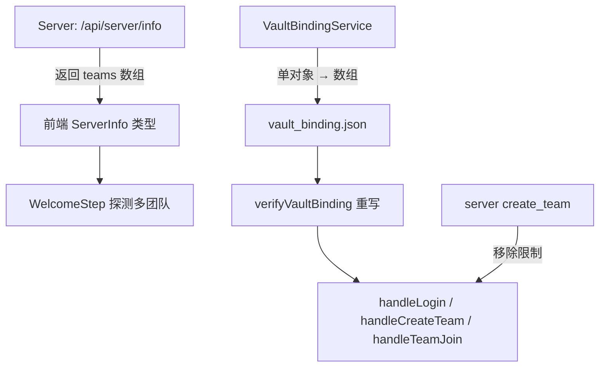

# Phase 4/5: 多团队支持 (Multi-Team Binding)

## 背景

当前系统假设 1 个 Vault 只绑定 1 个 Team（`vault_binding.json` 存储单个 `VaultBinding` 对象）。Phase 5 目标是让 **1 个 Personal Vault 可关联同一服务器上的多个 Team Vault**。

## 变更范围概览



---

## User Review Required

> [!IMPORTANT]
> **数据迁移**：现有 `vault_binding.json` 格式从单对象 `VaultBinding` 变为 `VaultBindings`（含 `bindings: VaultBinding[]`）。需要兼容旧格式的自动迁移逻辑。

> [!WARNING]
> **当前 UI flow**：登录后用户被 navigate 到 `connected_team`。多团队场景下，用户登录后需要选择"绑定哪个团队"。该逻辑暂时**不改动 UI flow**——登录仍绑定用户所属的第一个团队（通过 `server_info` 获取）。多团队切换将作为后续 Phase 5b 实现。

---

## 提议变更

### 后端: Server Info API 升级

#### [MODIFY] [server.rs](file:///Users/junior/Projects/slash/apps/server/src/routes/server.rs)

1. `ServerInfoResponse` 新增 `teams: Vec<TeamSummary>` 字段（保留 `has_team` / `team_name` / `team_vault_id` 做向后兼容）
2. SQL 从 `LIMIT 1` 改为 `fetch_all`，返回所有 team vaults
3. 新增 `TeamSummary` struct: `{ id: String, name: String }`

```diff
- let team: Option<(uuid::Uuid, String)> = sqlx::query_as(
-     "SELECT id, name FROM vaults WHERE space_type = 'team' LIMIT 1",
- ).fetch_optional(&state.pool).await.unwrap_or(None);
+ let teams: Vec<(uuid::Uuid, String)> = sqlx::query_as(
+     "SELECT id, name FROM vaults WHERE space_type = 'team' ORDER BY name",
+ ).fetch_all(&state.pool).await.unwrap_or_default();
```

响应结构（向后兼容）：
```json
{
  "has_team": true,
  "team_name": "首个团队名",    // 兼容旧客户端
  "team_vault_id": "xxx",       // 兼容旧客户端
  "has_pin": false,
  "teams": [                    // 新增
    { "id": "xxx", "name": "团队A" },
    { "id": "yyy", "name": "团队B" }
  ]
}
```

---

### 后端: 移除 create_team 的隐式限制

#### [MODIFY] [core.rs](file:///Users/junior/Projects/slash/apps/server/src/routes/team/core.rs)

当前 `create_team` 没有显式 `LIMIT 1` 限制（已允许多团队创建），无需改动。✅ 已确认。

---

### 前端: VaultBindingService 多团队绑定

#### [MODIFY] [VaultBindingService.ts](file:///Users/junior/Projects/slash/apps/desktop/src/services/VaultBindingService.ts)

1. **新增 `VaultBindings` 容器类型**：
```typescript
export interface VaultBindings {
    version: 2;
    bindings: VaultBinding[];
}
```

2. **`readVaultBinding` → `readVaultBindings`**：读取时自动兼容旧格式（单对象 → 数组迁移）
```typescript
export async function readVaultBindings(vaultPath: string): Promise<VaultBindings> {
    try {
        const raw = await readTextFile(bindingPath(vaultPath));
        const parsed = JSON.parse(raw);
        // v1 迁移：单对象 → v2 数组
        if (!parsed.version) {
            return { version: 2, bindings: [parsed as VaultBinding] };
        }
        return parsed as VaultBindings;
    } catch {
        return { version: 2, bindings: [] };
    }
}
```

3. **`writeVaultBindings`**：写入完整的 bindings 数组

4. **新增 `findConflictingBinding`**：检查是否存在不兼容的绑定
```typescript
/** 查找与 incoming 冲突的现有绑定 */
export function findConflictingBinding(
    bindings: VaultBinding[],
    incoming: VaultBinding,
): VaultBinding | null {
    return bindings.find(b => {
        // 服务器不同 → 冲突
        if (normalizeUrl(b.serverUrl) !== normalizeUrl(incoming.serverUrl)) return true;
        // 用户不同 → 冲突
        if (b.userId !== incoming.userId) return true;
        // 模式不同 → 冲突
        if (b.mode !== incoming.mode) return true;
        return false;
    }) || null;
}
```

5. **新增 `findExistingTeamBinding`**：检查是否已绑定过该团队
```typescript
export function findExistingTeamBinding(
    bindings: VaultBinding[],
    teamVaultId: string,
): VaultBinding | null {
    return bindings.find(b => b.mode === 'team' && b.teamVaultId === teamVaultId) || null;
}
```

6. **新增 `findOtherTeamBindings`**：查找同服务器上已绑定的其他团队（用于提示）
```typescript
export function findOtherTeamBindings(
    bindings: VaultBinding[],
    serverUrl: string,
    excludeTeamVaultId?: string,
): VaultBinding[] {
    const norm = normalizeUrl(serverUrl);
    return bindings.filter(b =>
        b.mode === 'team' &&
        normalizeUrl(b.serverUrl) === norm &&
        b.teamVaultId !== excludeTeamVaultId
    );
}
```

---

### 前端: useSyncFlow verifyVaultBinding 重写

#### [MODIFY] [useSyncFlow.ts](file:///Users/junior/Projects/slash/apps/desktop/src/features/settings/sync/useSyncFlow.ts)

1. **`ServerInfo` 类型扩展**：
```typescript
export interface ServerInfo {
    has_team: boolean;
    team_name: string | null;
    team_vault_id: string | null;
    has_pin: boolean;
    teams?: { id: string; name: string }[];  // 新增
}
```

2. **`verifyVaultBinding` 重写**（核心逻辑变更）：
   - 读取 `readVaultBindings()` 获取现有绑定数组
   - 检查是否已绑定该 teamVaultId → 若是，更新时间戳直接通过
   - 检查是否存在跨用户/跨服务器冲突 → 若是，弹出"冲突"对话框（行为不变）
   - 检查是否已绑定同服务器其他团队 → 若是，弹出"追加绑定确认"对话框
   - 无冲突 → 追加新绑定到数组

---

### 前端: WelcomeStep 多团队探测

#### [MODIFY] [WelcomeStep.tsx](file:///Users/junior/Projects/slash/apps/desktop/src/features/settings/sync/steps/WelcomeStep.tsx)

1. `probe()` 改为存储 `teams` 数组
2. 当 `teams.length > 1` 时，显示多团队列表（而非单一 `teamName`）
3. 仍然保持当前 Login / CreateTeam / JoinTeam 的按钮布局不变

---

### 前端: i18n

#### [MODIFY] [en/common.json](file:///Users/junior/Projects/slash/apps/desktop/src/locales/en/common.json) + [zh-CN/common.json](file:///Users/junior/Projects/slash/apps/desktop/src/locales/zh-CN/common.json)

新增 key：

| Key | EN | zh-CN |
|-----|-----|-------|
| `sync.vault_already_bound_title` | Additional Team Binding | 追加团队绑定 |
| `sync.vault_already_bound_body` | This vault is already bound to team "{{existingTeam}}". Continue binding to "{{newTeam}}"? | 此仓库已绑定团队「{{existingTeam}}」。是否继续绑定「{{newTeam}}」？ |
| `sync.probe_has_teams` | Server has {{count}} teams | 服务器已有 {{count}} 个团队 |

---

## 不在本次范围

- **团队切换 UI**：多团队切换器（Phase 5b）
- **多团队同步引擎**：同时同步多个团队内容（需要后端 sync 协议升级）
- **团队删除/解绑**：从 vault 移除团队绑定

---

## 验证方案

### 自动化
```bash
pnpm exec tsc --noEmit --skipLibCheck   # 前端零错误
SQLX_OFFLINE=true cargo check           # 后端零错误
```

### 手动验证
1. 创建 Team A → 登出 → 创建 Team B → 确认两个团队都在 `vault_binding.json` 的 bindings 数组中
2. 登出后重新登录 → 确认不再出现 `undefined` 冲突
3. 加入第二个团队时 → 确认弹出"追加绑定确认"对话框
4. 跨用户/跨服务器登录 → 确认仍触发"身份冲突"警告
