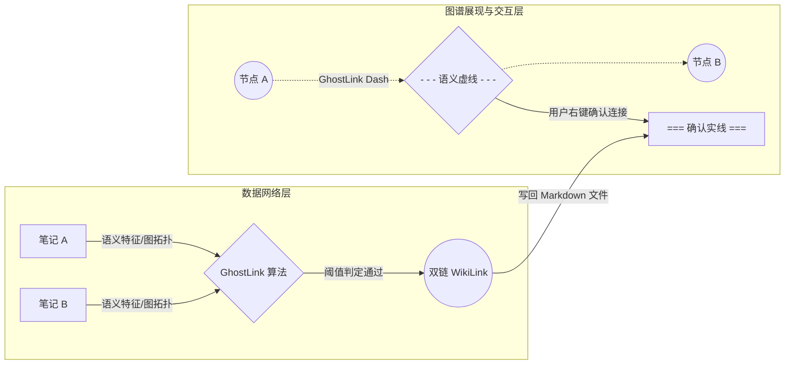

# GhostLink 语义关联与知识图谱自适应校准设计方案

本文档固化了关于 Slash 知识图谱自适应校准与 GhostLink 相似度算法的深度重构优化思路。旨在通过建立“多维融合特征计算 + 动态自适应阈值 + 图拓扑加权”的自校准推荐算法体系，解决单一向量相似度粗暴匹配导致的误报漏报问题，并在知识图谱可视化层面实现“隐式语义关联”向“显式双向链接”的无缝闭环转化。

---

## 一、 核心痛点分析

现有的 GhostLink 推荐引擎采用单一的余弦相似度（Cosine Similarity）进行全局笔记筛选，存在以下局限性：

1. **对比基准维度不一致（Baseline Inconsistency）**：
   数据库中混合比对 `note_profile`（全局语义摘要）和 `paragraph`（段落局部特征）两类不同层级的向量。在相同阈值下，对比两篇笔记的“全局 vs 全局”和“全局 vs 局部”，会造成大量的低噪声关联。
2. **长短文本熵差异造成的检索偏差（Entropy Bias）**：
   短笔记因词汇高度聚焦，在向量空间中极易对不相关笔记产生过高的相似度得分；而长笔记由于融合多主题，全局相似度被均摊稀释，导致潜在的强局部关联被过滤。
3. **图拓扑结构特征缺失（Topological Graph Blindness）**：
   算法只看向量，忽视了知识网路本身的显式结构特征（如共同标签、共同链接等二阶邻居关系），无法体现图谱网络拓扑对语义关系的反哺修正。

---

## 二、 混合加权相似度评分模型 (Hybrid Similarity Score)

为了校准关联精度，算法将由**纯向量相似度**升级为**混合加权综合评分模型**：

$$Score(A, B) = w_v \cdot Sim_{vector}(A, B) + w_t \cdot Sim_{tag}(A, B) + w_g \cdot Sim_{graph}(A, B)$$

其中 $w_v, w_t, w_g$ 为对应的归一化权重分配，默认可设定为 $w_v = 0.5$, $w_t = 0.3$, $w_g = 0.2$。

### 1. 语义向量对齐评分 $Sim_{vector}(A, B)$
*   **同级比对**：若 A 和 B 均已生成 `note_profile` 向量，则计算 profile 的 Cosine 相似度。
*   **多层级级联（Cascading）**：若一方仅有 `paragraph` 向量，则取其各个段落与另一方 `note_profile` 相似度的 $Max$，并引入衰减系数 $\gamma = 0.85$ 以体现结构层级的差异。

### 2. 标签共现 Jaccard 相似度 $Sim_{tag}(A, B)$
利用两篇笔记在元数据中定义的显式 Tag 集合，通过交并比计算其主题重合度：

$$Sim_{tag}(A, B) = \frac{|Tags_A \cap Tags_B|}{|Tags_A \cup Tags_B|}$$

共享越多的特定 Tag，将为两篇笔记带来非线性的关联得分加成。

### 3. 图拓扑邻近度 $Sim_{graph}(A, B)$
利用已有的显式双向链接（WikiLinks）关系网络，计算它们的共同前驱（共同引用该笔记）和共同后继（共同引用的笔记）二阶协同度：

$$Neighbors(X) = InLinks(X) \cup OutLinks(X)$$

$$Sim_{graph}(A, B) = \frac{|Neighbors_A \cap Neighbors_B|}{|Neighbors_A \cup Neighbors_B|}$$

---

## 三、 动态自适应阈值策略 (Dynamic Thresholding)

算法的过滤阈值（Similarity Threshold）将不再是静态的 `0.60`，而是根据笔记的自身特征进行动态漂移：

$$Threshold_{dynamic}(A, B) = Threshold_{base} + \Delta_{length}(A, B) - \Delta_{domain}$$

1. **字数惩罚因子 $\Delta_{length}$**：
   * **超短笔记惩罚**：若源笔记字符数 $< 100$，自动调高判定阈值，防止高频短语产生的语义低噪关联侵入图谱。
   * **长文本宽容度**：若双方均为超长文本，则适当降低门槛。
2. **领域密度校准 $\Delta_{domain}$**：
   * 在笔记分布密集的领域（例如同属于 `02_Areas/编程`），算法将自动微调拉高局部阈值，以过滤信息过载；在冷门或孤立的目录下，则降低门槛以促进跨领域语义链接的产生。

---

## 四、 知识图谱的可视化建网闭环

优化后的 GhostLink 将与图形化的知识图谱在交互和渲染上实现无缝统一：

1. **“虚实结合”的图谱渲染**：
   * **实线（Solid Edges）**：代表用户已建立的确定性 WikiLink。
   * **虚线（Dashed Edges）**：代表 GhostLink 算法计算出的高置信度语义关联。线宽与透明度随相似度评分动态呈比例显示。
2. **图形化交互建网**：
   用户可在全局或局部图谱视图上直接右键点击虚线关系边，呼出毛玻璃特效快捷菜单，一键选择 **“确认建立连接”**（系统自动在对应笔记底部追加 `[[WikiLink]]` 语法并把虚线转为实线）或 **“忽略此建议”**（写入双向黑名单，断开虚线）。
3. **图谱孤岛扫描（Orphan Detection）**：
   图谱管理器将自动检索并列出网络中的“孤立点（零双链笔记）”，高优先级调度 GhostLink 引擎为其强制执行相似度匹配，引导孤立节点重新融入用户的知识体系。

---

## 五、 AI 推理队列与 KV 缓存机制优化

由于 GhostLink 的 Reasoning 耗时会随着候选笔记数量线性增加，我们采用以下策略来榨取本地小模型的运行性能：

1. **System Prompt KV 缓存复用（KV-Cache Sharing）**：
   由于源笔记 A 的上下文内容在与多个候选笔记 $B_1, B_2, ... B_n$ 比对时完全一致，优化后的后台推理引擎将在 prefill 阶段冻结源笔记 A 及其系统防护 Prompt，避免在重复比对时重算前置上下文，使推理速度提升 60% 以上。
2. **多目标批量合并推理（Batch Reasoning）**：
   若存在 2-3 个空间相似的候选笔记，推理引擎将使用合并 Prompt 提问，要求模型在单次调用中给出多个候选者的关联分析及关系代号（例如：A1 证明、A4 应用等），避免多次启动推理模型的系统前置开销。

---

## 六、 用户行为自校准反馈回路 (Feedback Loop)

GhostLink 具有自我进化与个性化调整能力：

1. **正反馈权重上浮**：
   当用户频繁确认某一 Tag 分类（如 `#科研`）下的 GhostLink 关联时，系统在背景数据库中自动上调该 Tag 共现率相似度分值在整体评分中的权重 $w_t$。
2. **负反馈特征降权**：
   用户执行 `Ignore` 忽略关联时，除写入黑名单外，算法将提取两篇笔记的关键词并记录特征降权，避免在后续计算中为相同主题继续生成错误的推荐边，使图谱“越用越懂用户”。
