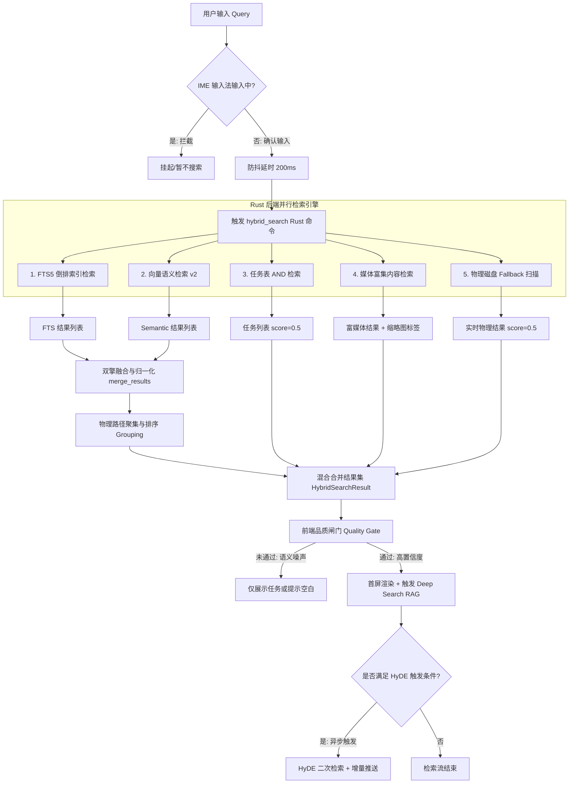

# Slash 全局搜索模块业务规则白皮书 (Search Business Rules Whitepaper)

## 1. 概述与核心商业价值

在知识管理与第二脑（Second Brain）产品中，**“搜索”**是用户与海量碎片化数据交互最核心的入口。传统笔记软件的搜索往往面临三大痛点：
1. **关键词匹配的机械性**：用户输入“如何做产品审计”，若笔记中仅有“审计流程与Junior职责”或“对账指南”，由于词汇差异导致漏检。
2. **向量语义检索的长尾噪声**：纯向量语义检索（Semantic Search）会将大量相似度极低、文不对题的笔记作为长尾干扰推送给用户。
3. **数据非实时性**：新创建或刚修改的笔记，其向量计算（Embedding）和倒排索引（FTS）具有滞后性，导致用户搜索不到“刚刚”记录的重要内容。

**Slash** 通过独创的 **双擎混合检索（Hybrid Search）、基于 Sidecar 的媒体富集内容匹配（Whisper + OCR）、HyDE 搜索扩展、多层级向量匹配以及 RAG 深度智能洞察**，从根本上解决上述痛点。本白皮书基于 Slash 桌面端源码，反向提炼出一套兼顾极致性能、实时一致性、智能人机交互和极致降噪的产品业务规则。

---

## 2. 全局搜索混合架构 (Hybrid Search Architecture)

Slash 混合搜索采用一种 **后端多路并发检索 + 混合评分归一 + 笔记物理聚集 + 前端分层渲染** 的高集成设计。

### 2.1 全链路架构图
以下是用户发起检索后，系统从输入处理到最终渲染的完整链路：



---

## 3. 检索优先级与双擎融合机制 (BM25/向量权重混合)

为了让“高精度字面匹配”与“深层语义关联”达到完美平衡，Slash 引入了**加权双擎融合算法**，解决两套检索算法分值维度不一致（FTS5 的 BM25 为负数分值，向量相似度为 Cosine 分值）的对齐难题。

### 3.1 双擎融合规则表
| 检索源 | 底层算子 | 算子数值区间 | 默认权重比 (Weight) | 核心业务诉求 |
| :--- | :--- | :--- | :--- | :--- |
| **FTS5 关键词检索** | SQLite `bm25()` | $(-\infty, 0)$，越小越匹配 | **0.4** (40%) | 保证绝对精确的字面命名、专用缩写、ID 检索的强关联性。 |
| **向量语义检索 v2** | 余弦相似度 (Cosine) | $[0.0, 1.0]$，越大越匹配 | **0.6** (60%) | 打破字面词义限制，提取意图层面的深层关联，容错错别字与近义词。 |

### 3.2 归一化与融合算法设计
1. **关键词 FTS5 分数归一化**：
   FTS5 引擎返回的 `bm25` 分数是负数，绝对值越大表示匹配度越高。
   - 系统首先在本次 FTS 结果集中，提取绝对值最大的分值作为基准：
     $$\text{max\_keyword\_score} = \max(|s|), \quad s \in \text{Keyword Results}$$
   - 将各个单项分数进行区间翻转和映射，使其落入 $[0.0, 1.0]$，再乘以关键词权重：
     $$\text{Score}_{\text{keyword}} = \left( 1.0 - \frac{|s|}{\max(\text{max\_keyword\_score}, 1.0)} \right) \times \text{Weight}_{\text{keyword}}$$
     *(该算法确保本批次中字面最匹配的笔记，其关键词最终得分无限接近 0.4 满分；字面匹配最差的得分归于 0)*。
     
2. **语义相似度分数归一化**：
   直接将 Cosine 相似度分值乘以语义权重：
     $$\text{Score}_{\text{semantic}} = s_{\text{cosine}} \times \text{Weight}_{\text{semantic}}$$
     
3. **分值合并与非排他保留**：
   - 算法不采用简单的“按路径去重（dedup by path）”，而是将 FTS 归一化结果与 Semantic 归一化结果合并成一个平铺列表，允许**一篇笔记以不同的匹配源（match_source）多次呈现在列表中**（如一段由于关键词匹配，另一段由于语义相关）。

---

## 4. 同一笔记物理聚集与前端展示机制

平铺的匹配段落虽然展示了丰富度，但也极易导致同一篇长笔记因多处匹配而“刷屏”，导致检索效率下降。Slash 创造性地实施了**“路径内聚分组，组间按最强项排序”**的物理聚集机制。

### 4.1 后端聚集逻辑
1. 融合排序后，对结果平铺列表按路径（`path`）进行哈希分组。
2. 每一个分组记录该笔记内所有匹配项中的最高分：
   $$\text{best\_score}_{\text{group}} = \max(\text{score}_{i}), \quad i \in \text{group.matches}$$
3. 对所有笔记组（Group）按 $\text{best\_score}_{\text{group}}$ 进行降序排序。
4. 物理扁平化展开：按组的最终排位，将组内的 matches 依次平铺输出。这使得**同一笔记的所有匹配段落全部物理上相邻排列，且整组的位置由组内“最亮眼”的那个最强匹配决定**。

### 4.2 前端折叠与深度交互
- **首要代表展示**：前端界面渲染时，每篇笔记仅默认展示其**最强匹配项（Best Match）**，直接呈现 Title、Path、Badges（如“全貌”、“关键词”、“语义”的徽章）以及代表性的 Snippet 预览。
- **动态折叠抽屉**：如果该笔记有额外的匹配段落（Extra Matches），前端会自动渲染一个灰色折叠标签：`“还有 X 个匹配项”`。
- **微交互展开**：用户点击折叠标签，可直接拉开折叠面板，清晰展示其它所有匹配项的匹配源（如 summary, paragraph, title）、匹配类型徽章（keyword, semantic, hyde）以及对应文本片段。
- **Intra-note Navigation (笔记内导航)**：通过精细段落匹配（`paragraph`），每个匹配项都附带了原始笔记中的 `line_number`（行号）。用户点击时，前端能够一键跳转并准确定位至笔记的对应行数，大幅提升长文档阅读体验。

---

## 5. 向量语义搜索 v2 与多层级向量匹配

在向量检索上，Slash 告别了“整篇笔记大杂烩 Embedding”的落后模式，升级为 `embeddings_v2` 多层级精细化语义体系。

### 5.1 三大产品层级语义模型 (Multi-product Matches)
| 产品层级 (Product Type) | 匹配对象 | 特征片段来源 | 核心作用 |
| :--- | :--- | :--- | :--- |
| `paragraph` | **细粒度段落级** | 笔记内各个Heading之下的物理段落 | 解决“长文本淹没”痛点，支持直接跳向笔记内部段落。 |
| `note_profile` | **全貌概览级** | 笔记特征画像（由系统特征提取得到） | 匹配整篇笔记的核心叙事框架与核心内容。 |
| `summary` | **AI 摘要级** | AI 自动提炼的高精简一句话 Summary | 匹配宏观主题，通常是用户模糊意图检索的极佳参照。 |

### 5.2 精准 heading 段落定位与 Snippet 提取
当命中类型为 `paragraph` 时，后端如果仅展示无意义的图像或空文本会导致体验崩溃。Slash 实施了如下提取策略：
1. **Heading 清洗**：从 `heading_path` 中用正则剔除类似 `(part 1)`、`(part 2)` 等分块切割标记。
2. **正文动态定位**：如果存在 Heading 路径（如 `架构设计 > 混合搜索`），后端在缓存的 Markdown 物理文件中进行逐行检索，一旦定位到匹配的 `# 混合搜索` 行，则立即截取其**下方 3 行内且不超过 120 个字**的内容作为 Snippet 呈现给前端。
3. **无 Heading 容灾**：如无 heading，则默认抽取笔记正文前 120 字作为摘要展示。

---

## 6. 音视频转录与 OCR 媒体富集内容匹配

Slash 通过本地 Sidecar 可以离线提取用户笔记中引用的图片（OCR）与音视频（Whisper 语音转写）。这部分极其宝贵的非文本数据，通过 **“媒体富集侧表映射”** 与 **“前端安全路径实时缩略”** 打通了多模态搜索的闭环。

### 6.1 检索双路防线
- **主表多模态 Embedding 扫描**：检索 `embeddings_v2.enriched_content`（包含媒体文字化后的综合语境），使媒体内容能天然参与向量检索。
- **侧表 `media_enrich_cache` 倒排检索**：当主表索引尚未就绪，直接对媒体缓存侧表执行关键词多词 AND 匹配，随后利用 `asset_hash` 反向关联所归属的笔记。

### 6.2 媒体高亮呈现与缩略图渲染
当用户检索到媒体富集内容时，Slash 在 Snippet 中采用如下处理：
1. **缩略图识别码解析**：
   后端会检索对应的 Markdown 文件，提取图片或视频链接 ``，并直接包装在 Snippet 头部。
2. **前端本地协议安全映射**：
   前端收到带有媒体引用符号的 Snippet 后，正则检测 `MEDIA_REGEX` 提取 `assets/filename` 相对路径。
3. **渲染转换**：
   - 提取文件后缀判断是图片还是视频类型。
   - 调用 Tauri 专有的 `convertFileSrc(absPath)`，绕过沙箱将本地物理路径安全地转换为渲染资源链接。
   - 在搜索面板结果区，**直接渲染出高精度的图片缩略图或视频静态预览卡片**，让非文本内容“不仅可被搜到，还能一眼被看到”。

---

## 7. 实时文件系统扫描防线 (Fallback Content Scan)

系统后台的倒排索引（FTS）和向量数据库（Vector DB）是由系统监听器异步维护的。在新创建笔记、或者外部同步笔记拷入的极端空档期，必然存在“索引真空”。为此，Slash 设立了**强力物理磁盘检索防线**。

### 7.1 Fallback 触发时机
混合搜索在完成 FTS 检索和向量相似度融合后，如果发现当前合并结果不足限制条数（`limit`），则会启动 `search_file_contents` 降级容灾，直接在本地磁盘的 Vault 文件夹下全量物理扫描 `.md` 文本。

### 7.2 性能防灾与降噪设计
- **防冗余去重**：物理扫描前，将当前已命中 FTS 和语义的笔记路径加入 HashSet 中，扫描时遇到这些路径自动跳过。
- **隐藏文件过滤**：跳过所有以 `.` 开头的隐藏文件夹（如 `.obsidian`、`.git`）及隐藏文件，防范配置噪声干扰。
- **YAML Frontmatter 剔除**：在磁盘读取后，首先检测行首 `---`，精确定位第一个闭合 `\n---`，自动剥离 YAML 前置属性块。确保检索完全发生在用户编写的正文中，消除属性键值对造成的虚假匹配。
- **短词词边界强保护**：
  在多词 AND 匹配中，若用户输入的检索词长度 $\le 2$（如英文“`no`”、“`go`”），如果使用简单字串包含判断，会导致大量单词子串错配（如匹配到 `note`, `good`）。
  Slash 在此限制下采用**词边界正则算法**：
  $$\text{content\_lower}.match\_indices(term).any(\text{is\_word\_boundary})$$
  要求被匹配词的前后字符必须是非英文字符（即空格、标点或换行），杜绝短词错配灾难。长词（$>2$ 字符）则继续执行常规高速 `contains` 匹配以保障效率。

---

## 8. HyDE (Hypothetical Document Embedding) 虚拟文档语义检索扩展

为了解决用户检索词“过短、意图过虚”（例如“如何处理客户负面反馈？”）导致的语义搜索相似度过低的硬伤，Slash 后台嵌入了极其前沿的 **HyDE（假设性文档嵌入）语义生成检索技术**。

### 8.1 HyDE 前置触发门限
HyDE 是大模型生成任务，消耗 Token 和算力。为避免不必要的性能开销，系统制定了严苛的前置检测指标，仅在以下**四项指标同时满足**时在后台静默发起：
1. 用户输入查询长度 $\ge 3$ 个字符。
2. 混合搜索结果中，**关键词检索没有一次命中**（`keyword_count == 0`）。
3. 混合搜索返回的最佳语义分值偏弱（$\text{bestScore} < 0.4$）。
4. 排除已搜出的路径，依然有扩展容积。

### 8.2 HyDE 运作逻辑与增量推送
1. **假设文档生成**：调用 LLM 大模型基于用户提问，自动编造一篇“字数合理、结构严密、口吻正确”的 hypothetical document（假设性回答笔记）。
2. **假设向量检索**：将这篇假想笔记生成 Embedding，用其在 `embeddings_v2` 数据库中二次检索。
3. **差异化去重**：使用 `existing_paths_set` 严格剔除在 Hybrid 第一阶段已经被展示过的笔记，确保找出来的全部是“遗落的深层语义关联”。
4. **降低闸门**：考虑到 HyDE 的相似度衰减，检索的 Cosine 阈值从 Hybrid 阶段的 `0.4` 放低至 `0.35`，标记 match_type 为 `"hyde"`。
5. **事件增量推送 (Incremental Loading)**：
   HyDE 结果查出后，后端立刻向 Tauri 窗口广播 `search:hyde-results` 事件。前端监听到事件后，无需刷新整个面板，而是**以平滑的过渡动画将 HyDE 新命中的卡片增量压入结果区最底部，并打上带有魔法棒徽章的 `HyDE` 黄色标签**，使用户体验到“后台深度联想”的惊喜感。

---

## 9. 深度搜索问答 (Deep Search / RAG)

当用户意图明确且库中存在事实支撑时，Slash 自动启动基于 RAG（检索增强生成）的 Deep Search，为用户提供一份横跨数篇笔记的**高浓度结构化洞察报告**。

### 9.1 智能品质门限品质闸门 (Quality Gate)
大模型的“幻觉”是严重影响搜索品质的噪声。Slash 设计了智能品质门限，如果输入属于**无意义语义噪声**，则会坚决熔断 RAG 的触发，以维护结论的绝对严谨。
- **中日韩（CJK）文字符密度校正**：
  英文单字（如 `yes` / `no`）在向量库中相似度得分通常处于高噪声的假阳性状态，而 CJK 单个字符（如“税”）携带了高密度的语义。
  系统正则检测是否存在 CJK 字符。如有，则**强行将有效字数修正，避免执行英文字数的降级惩罚**。
- **阈值熔断阻拦**：
  $$\text{threshold} = \begin{cases} 
  0.35, & \text{有效字数} \le 1 \\
  0.28, & \text{有效字数} > 1 
  \end{cases}$$
  如果混合搜索结果的最强相似度低于对应的 $\text{threshold}$，且没有关键词命中，系统判定此次检索为“低置信度语义噪声”。**前端直接清空结果，熔断并不再触发任何 Deep Search 服务。**

### 9.2 媒体富集 RAG 上下文重组 (Media-Enriched RAG)
为使大模型回答能够洞察图片和音视频内的信息，Slash 在构建上下文阶段（Context Assembly）调用 `enrich_content_for_rag` 进行了多模态解码：
- 抽取相似度排序前 5 的笔记作为参考上下文。
- 逐一读取其 Markdown 原文，当正则捕获到图片引用 `` 时，提取 hash 去 `media_enrich_cache` 中检索其 OCR / Whisper 音视频文本。
- 如果侧表存在富集转译，则**在内存中瞬间将 `` 标记块原地替换为**：
  ```markdown
  [Image: filename.png]
  (以下为系统提取的媒体特征描述：)
  [OCR或语音转译的详细文本内容...]
  ```
- 这种替换打破了文本 RAG 与非文本媒体之间的壁垒，让 LLM 能够毫无障碍地推理笔记里插图、会议录音的实际含义。
- **Token 保障机制**：为防范大型笔记撑爆上下文窗口，单篇笔记强制截断前 3000 字，并在超长处标注 `...(truncated)`。

### 9.3 LLM 限制性生成与去噪
为保证输出回答的极高严谨性，LLM 调用的温度系数（Temperature）被限制在极低的 **`0.3`**（偏向严格纪实，避免文学创作）。
LLM 被限制在以下系统提示词（System Prompt）牢笼中：
1. **只概括不罗列**：只做交叉关联，绝不能按笔记序号 1、2、3 一篇篇复述，只提炼本质。
2. **纯事实防空谈**：坚决不输出任何常识，如果笔记里没写，就直接坦白无法回答，绝不道歉，绝不胡编乱造。
3. **引用标点对齐**：使用 `[[Note Title]]` 标志进行严谨引用，引用必须置于句尾标点符号**之后**。
4. **语言双轨保护**：
   - 必须使用用户当前的系统界面语言区域（Locale）生成总结。
   - **当引用或摘抄原始笔记内容时，严禁翻译该文本，必须保留笔记创建时的原始语言**，防止翻译失真导致事实歪曲。
5. **极简字数物理铁律**：每一个洞察点**小于 30 字**，总回复字数**小于 150 字**！

### 9.4 前端轻量级结构化渲染器
为了在毫秒级时间内将 RAG 生成的高密度文本渲染到屏幕，且不引入繁重的第三方 Markdown 库造成首屏渲染卡顿，前端专门开发了专用的**轻量正则块级渲染器（Lightweight Block Renderer）**：
- **安全块级分离**：自动按行识别 `## Heading`（二级标题）、`- Item`（列表项）以及 `1. Item`（有序列表），解析为对应的 React 结构化标签，提供极高的排版观感。
- **动态引用按钮转化**：
  使用正则 `/\[\[(.+?)\]\]/g` 识别 LLM 输出中的 `[[Note Title]]`。
  通过比对 RAG 传入的 references 数组，如果匹配到有效路径，则**瞬间将其转化为一个带有紫色高亮的 `<button>` 引用锚点组件，并打上 `ExternalLink` 魔法图标**。
  用户点击该按钮，即可实现全局搜索面板秒级跳转，精准打开引用的原始文档，完成了从“搜”到“看”再到“溯源”的完美商业闭环。

---

## 10. 前端高阶输入降噪策略

全局搜索是典型的“高频交互”场景。用户每输入一个词，都伴随着大量的设备震荡和接口调用。Slash 在前端实施了极致的防抖和防噪保障。

### 10.1 IME 输入法合成保护 (Composition Protection)
当用户使用中文拼音输入法输入时（如输入“代码”），拼音未确认前会持续触发 `onChange`（输入了 `d`, `da`, `dai` 等中间假名）。如果直接发起检索，将造成灾难性的卡顿和 Token 浪费。
- **机制**：
  - 绑定 `onCompositionStart`：一旦用户开始使用拼音等合成输入，系统立即将 `isComposingRef.current` 设为 `true`。
  - **拦截输入防抖**：在 `true` 状态下，所有的 `handleInputChange` 事件被完全拦截，防抖定时器完全不予激活，不发起任何后端检索，以维持系统的绝对安静。
  - 绑定 `onCompositionEnd`：用户按空格或回车选定汉字后，触发本事件，重置 `isComposingRef.current` 为 `false`，并手动以最终汉字更新 Query，清空上一个定时器，等待 200ms 防抖期满发起唯一的真实搜索请求。

### 10.2 置信度分差阻尼二分展示法 (Confidence Classification)
即使经过了后端的过滤，混合搜索仍可能返回一些“相关但不够优秀”的次要结果。Slash 在前端对这些结果进行**基于分差的二分法精简展示**。
- **分差阻尼公式**：
  前端收到合并的 `unifiedItems` 列表（包括分组后的笔记与权重固定为 0.5 的任务项）后，逐项扫描它们的分数，并计算相邻两项之间的分数差值（Gap）：
  $$\text{Gap}_i = \text{Score}_i - \text{Score}_{i+1}$$
  如果检测到某一项的差值 $\text{Gap}_i \ge 0.10$（代表后续结果的相关度发生了悬崖式坠落，大概率是一堆噪声长尾），且能够保证保留的 $\text{High Confidence}$ 列表包含至少 1 项结果，系统会在此处将结果集一分为二。
- **折叠收拢表现**：
  - 前半部分：划归为 `highConfidenceItems`（高置信度），**默认直接在搜索面板首屏完全渲染**，极其利落干净。
  - 后半部分：划归为 `lowConfidenceItems`（低置信度），**默认全部隐藏**。在列表最下方渲染一个收折条：“查看另外 X 个低相关度结果”。用户主动点击时，才能展开查看剩余的内容。这在视觉层面上，给予了用户极致的产品高级感与对数据绝对的掌控感。

---

## 11. 总结

Slash 的全局搜索不仅仅是一系列搜索算法的拼凑，而是一套**将后端多维检索引擎（FTS5、向量语义、物理扫描、Whisper/OCR 富媒体）与前端高度体贴的人机交互（IME 拦截、置信度二分展示、轻量 RAG 引用锚点、HyDE 异步增量渲染）无缝缝合的艺术品**。

通过严格遵循上述业务规则，Slash 能够提供极其迅捷、全知、干净的智能搜索体验，为知识工作者打造真正可靠、无噪声的个人数字第二脑。
