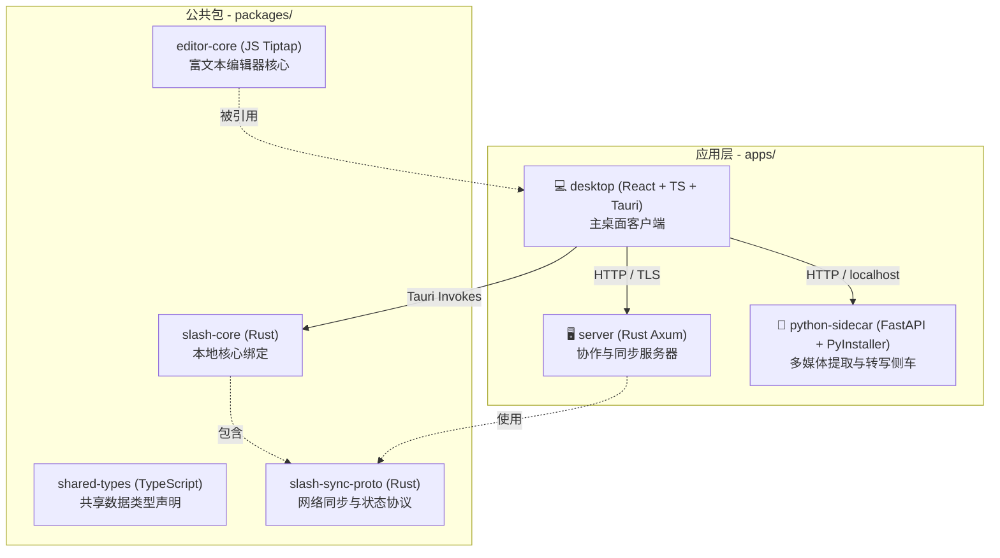

# Slash 项目深度分析与开发准备报告

本报告旨在对 Slash 项目的技术架构、核心模块、数据流转以及后续开发规划进行全面仔细的梳理，为接下来的 P1-P3 阶段开发做好充分的工程和设计准备。

---

## 一、 项目定位与技术栈大图

Slash 是一个本地优先（Local-First）且深度融合 AI 语义织网、多媒体音视频转写与团队同步协作的现代化双向链接笔记应用。其采用了 **Monorepo (pnpm workspaces + Cargo workspace)** 架构，实现了前/后端、桌面/服务端的多端协同：

### 关键技术选型
- **客户端前端**：React 19 + TypeScript + TailwindCSS + Radix UI + TipTap 编辑器生态 + Tldraw 绘图画布。
- **客户端本地运行时**：Tauri v2 (Rust 驱动，提供安全系统 API、本地进程管理与多线程任务分发)。
- **多媒体处理端 (Sidecar)**：Python FastAPI + PyInstaller 静态打包，包含 `faster-whisper` (本地语音离线高精度转写) 与 `MarkItDown` (各种格式文档转 Markdown)。
- **网络协作端 (Server)**：Rust Axum Web 框架 + SQLx (SQLite) + S3 (MinIO/S3 兼容云存储后端)，负责集中式同步、协作通知与权限流转。

---

## 二、 核心业务机制与架构深度解析

### 1. TipTap 编辑器生态与 Tldraw 画布集成
- **Markdown 双向序列化**：通过 `prosemirror-markdown` 与 `tiptap-markdown`，实现 ProseMirror 内存 DOM 与本地磁盘 `.md` 文件的无损双向转换。复杂交互节点（如画板）采用**双模存储模式（Dual-Modality Storage）**：Markdown 文件中保存占位符/导出的 PNG 图片，同时生成同名的 `.json` 边侧文件 (Sidecar) 保存原始矢量图 JSON 状态。
- **自定义 Tiptap 扩展**：
  - `MixedListExtension`：解决复杂混合列表（有序、无序、任务列表）的对齐与缩进问题。
  - `CustomParagraph`：优化了 CJK (中日韩) 输入法拼音输入时的光标跳变与导航细节。
  - `SlashCommand`：提供类似 Notion 的斜杠快捷指令菜单。
- **WebKit 渲染补偿 (Tier 12 - getSvgJsx)**：在 macOS (WebKit 内核) 下导出 Tldraw 矢量图为 PNG 时，为解决 SVG viewBox 裁切与 geometry 塌陷问题，设计了 Clone-and-Compensate 补丁。通过克隆 SVG 节点、强制重置 bounding box 并进行布局补偿，确保导出的 PNG 图像保持 100% 原始保真度。

### 2. 本地 SQLite 数据库与数据生命周期
- **SQLite 状态管理**：客户端内置 SQLite 数据库，用于缓存笔记元数据、双向链接图谱、任务列表、向量缓存与同步队列。数据库在应用启动时执行自检与 Migration (`migrations.rs`)。
- **本地 Watcher 监听机制**：通过 Rust 的 `notify` 库启动本地 filewatcher。当外部修改 Markdown 时，触发 `WatcherState` 管道，自动调用 `scan_single_file` 更新数据库元数据，并同步向前端发送更新事件，实现 **Editor Continuity (编辑器无缝重连与刷新)**。
- **Vault 切换安全防线**：为了解决跨 Vault 切换时由于异步渲染导致的资源路径错乱问题，引入了 `clearRoot` 机制（**Immediate Invalidation**）。在 Vault 切换瞬间，强制清空前端缓存的文件系统根路径，防止图片或附件加载到旧 Vault 的脏路径。

### 3. AI 驱动的 PARA 归档与语义检索
- **Ollama 离线大模型集成**：客户端支持通过 Ollama 连接本地运行 of LLM (如 Llama 3 / Qwen)，并设计了退避降级方案。
- **PARA 自动分类引擎**：
  - 双语领域词典（Domain Dictionary）预过滤。
  - 基于 `embeddings_v2` 的本地语义向量库进行余弦相似度粗筛。
  - 最终提炼的上下文提交给本地 LLM 进行高精度判定，智能建议将笔记归档至 `00_Inbox`、`01_Projects`、`02_Areas`、`03_Resources` 或 `04_Archive`。
- **RAG 混合检索架构 (4-Pillar Unified Search)**：
  - **FTS5 全文检索**：利用 SQLite FTS5 对笔记内容做高性能快速匹配与 Char Boundary 截断安全切片。
  - **向量检索**：调用本地向量模型生成 Query 嵌入，实现基于语义相似度的 Deep Search。
  - **知识合成 (RAG)**：搜索结果结合本地 LLM，在温度 0.0 的确定性模式下，自动生成回答摘要。
- **GhostLink (幽灵链接) 语义关联**：通过后台语义引擎扫描未显式关联但存在强语义相关性的笔记，为用户生成关联推荐，支持单键建立维基链接 (`[[Note]]`)，并提供可视化的推荐置信度推理缘由。

### 4. 本地化 Python Sidecar 管道
- **本地零依赖分发**：利用 PyInstaller 将包含 FastAPI、faster-whisper 以及 MarkItDown 依赖的 Python 环境整体打包成平台相关的二进制文件，避免在用户系统上要求安装 Python 环境。
- **音视频离线转写与富媒体语义织网**：
  - 导入 `.mp3`、`.mp4` 等多媒体文件时，Tauri 后台调用 Sidecar 的 `/whisper/transcribe` 进行离线语音转文字。
  - 使用 MarkItDown 提取 PDF、Office 格式及图片的结构化内容，并写入 `media_enrich_cache`。
  - 随后提交至 Embedding Pipeline 构建向量，使得用户可以通过搜索媒体中的「台词」、「PPT 中的文字」或者「图片的 AI 描述」来定位笔记 and 附件。

### 5. 集中式网络同步与 UUID-First 架构转型
- **UUID-First 身份体系**：这是 Slash 最核心的架构升级。在早期版本中，笔记和目录同步完全依赖于文件相对路径，如果两端同时 rename 文件夹，极易导致冲突甚至数据丢失。
  - **改造方案**：引入不可变的 `directory_id` 与 `file_id` (UUIDv4) 作为实体的唯一主键，将文件路径降级为可变的位置属性（`current_path`）。
  - **纵深防御 (Double-Layer Detection)**：客户端通过 UUID 碰缘算法阻止 rename 被误判为 "删除旧文件 + 新建新文件"；服务端 negotiate 模块自动将路径变更处理为 `UPDATE file_states`，确保不丢失历史版本与协作讨论。
  - **幽灵目录隔离**：通过 directories 实体与局部唯一索引（只针对 alive 状态的目录建立唯一约束），彻底斩断了重建同名文件夹时误继承已删除目录的 trash 或历史权限的安全漏洞。
- **协作安全与 RBAC**：基于 Vault、Directory 的细粒度权限控制，实现只读权限沙箱保护（`TeamReadOnlyGuard`），防范未授权的写入覆盖。

---

## 三、 后续开发推进路线图 (P1 ~ P3)

根据最新审计与开发进度，以下是具体开发重点及当前完成状态：

### P1：发布阻断性改造（Must Have）
1. **P1-1：Sidecar 首次分发与兼容性部署（✅ 已完成）**
   - **挑战**：打包出来的 `.dmg` / `.exe` 必须无缝释放 Sidecar 目录至用户主机的 App Support (`~/Library/Application Support/Slash/sidecar`)，并且读取 `version.json` 实施版本判断。如果用户的客户端版本落后于 Sidecar 最低要求，则触发自动降级或安全提醒。
   - **实现路径**：已完善 `apps/desktop/src-tauri/src/core/sidecar.rs` 中的 `ensure_sidecar_installed`（引入 `version.json` 校验，损坏时强制重装）与 `check_version_compatibility` 逻辑（Bundle 版本高于 Installed 时自动静默覆盖升级）。
2. **P1-2：Sidecar 进程看门狗 (Watchdog)**
   - **挑战**：多媒体转写、模型切换属于 CPU/GPU 密集型任务，容易造成 Sidecar 卡死或被系统强制 Kill。
   - **实现路径**：设计 Rust 守护线程对子进程进行心跳探活（`/health` 端点），在子进程意外崩溃时提供指数退避重启（最大 3 次，间隔 1s、2s、4s），并在重启期间对端口变化做动态路由转发。
3. **P1-3：Whisper 模型管理界面**
   - **实现路径**：在前端 React 设置面板的 AI 标签页中增加 Whisper 模型选择及下载组件。调用后端的模型拉取 API，实时通过 SSE 或 Tauri 事件通知前端展示下载百分比与网络速度，并在 Sidecar 内部实现动态加载（Unload 旧模型，Load 新模型）。
4. **P1-4：CI/CD 自动化多平台 Sidecar 打包**
   - **实现路径**：编写 GitHub Actions 构建矩阵，自动在 macOS (x86/ARM)、Windows、Linux 容器中触发 `python build.py`，并将混淆和精简后的二进制文件归档，注入到 Tauri 打包流程的 `binaries` 中。

### P2：体验与系统优化（Should Have）
1. **P2-1：图片/媒体悬浮语义预览**
   - **实现路径**：利用已有的 `get_enriched_content` Tauri Command。在前端 TipTap 的 Image NodeView 中，利用浮动 Popper 组件监听 hover 事件，延时 500ms 触发查询。若已索引，毛玻璃浮窗显示图片的 AI Tags 及富文本描述；若未完成，显示 "语义索引中..."。
2. **P2-2：细粒度媒体索引进度条（✅ 已完成）**
   - **实现路径**：改造了 Rust 侧的 `media_scheduler.rs`，在处理多媒体嵌入时，通过 Tauri Emitter 定期 emit `media:progress` 事件（携带当前处理的文件序号与总数），并在前端 `EditorStatusBar.tsx` 订阅并展示 "索引中 (当前项/总项)..."。
3. **P2-3：Sidecar 热更新与远程签名**
   - **实现路径**：实现独立于主应用的 Sidecar 静默热更新逻辑。下载后进行 SHA-256 校验和公证签名检查，并在应用重启时自动替换。

### P3：技术债务清偿与图谱调优（Nice to Have）
1. **P3-1：Worker 并发保护与竞态加锁（✅ 已完成）**
   - **实现路径**：在 `commands/embedding.rs` 的手动触发入口获取异步 Mutex 锁；在后台 `worker.rs` 的循环体头部通过 `blocking_lock()` 获取该锁，实现前后台任务串行化，彻底防范并发写库/抢占侧车。
2. **P3-2：本地嵌入去噪优化（✅ 已完成）**
   - **实现路径**：在 `denoise.rs` 中完整实现了 LaTeX 分隔符清理和 Markdown 样式富文本标签过滤，提升语义特征嵌入向量的精度，并通过了专项测试。
3. **P3-3：提示词防御 (Prompt Injection Guard)（✅ 已完成）**
   - **实现路径**：开发了 XML 敏感闭合标签预净化工具，对用户输入应用包裹，并在系统提示词中追加零信任安全防护指令，隔绝分类 (classification) 和推理 (reasoning) 场景的注入隐患。
4. **P3-4：代码异味重构 (`negotiate.rs` 拆分)（✅ 已完成）**
   - **实现路径**：已将 `apps/server/src/routes/sync/negotiate.rs` 重构拆分为 `negotiate/` 目录下的 `context.rs` (上下文定义)、`deletion.rs` (删除墓碑及回收站清理)、`rename.rs` (重命名检测) 与 `diff.rs` (差异协商的核心算法)，提高代码内聚力与可维护性。
5. **P3-5：`media_enrich_cache` 过期与重刷策略**
   - 当用户升级本地视觉大模型或 Whisper 模型后，历史提取的劣质文本无法自动更新。需要在 Cache 表中持久化 `model_hash`，模型升级后自动将对应缓存标为 Stale，或者在系统设置中允许用户手动 "重建全部多媒体索引"。
6. **P3-6：知识图谱校准与 GhostLink 精度优化**
   - 对 GhostLink 语义关联进行加权优化，校准余弦相似度阈值，改善非对称关联的推荐置信度。

---

## 四、 开发设计规范 (UI-UX-Pro-Max)

根据项目根目录下 `.agent` 中定义的 UI-UX 规范，接下来的任何界面开发（如 **Whisper 模型管理 UI**、**图片 hover 预览**、**状态栏进度** 等）必须遵循以下高级视觉与交互准则：

1. **毛玻璃特效与深色模式适配**
   - 浮窗、卡片以及悬浮预览均应使用和谐的 HSL 柔和色调（避免使用高饱和度的纯红、纯绿）。
   - 示例：`bg-white/80 backdrop-blur-md border border-gray-200`（光照模式） / `bg-zinc-900/80 backdrop-blur-md border border-indigo-500/20`（深色模式）。
2. **拒绝 Emoji 侵入 UI 元素**
   - 设置项图标、状态栏图标等核心 UI 严禁直接使用 emoji，必须从 Lucide React 中选择线框风格一致的矢量图标。
3. **稳定的动效与交互状态**
   - 所有 Hover 态和过渡动效的时间控制在 `150ms ~ 300ms` 之间（推荐使用 `transition-all duration-200 ease-in-out`）。
   - 禁止在 Hover 时使用会导致整体文档排版发生位移的 `scale` 变形。
   - 所有可点击或可悬浮交互的组件必须显式附带 `cursor-pointer` 属性。
4. **无障碍对比度与排版**
   - 正文字体色彩对比度保证在 4.5:1 以上。
   - 文本提示信息必须配合图标，不能单纯依赖红/绿等色彩来向用户传达状态。
