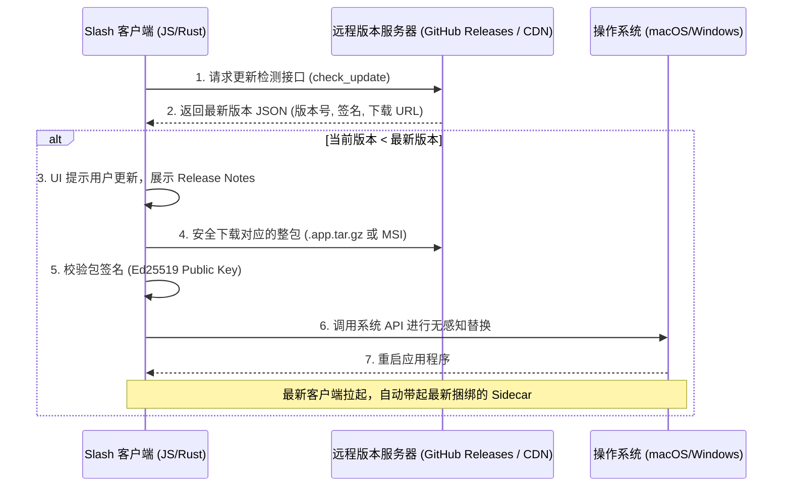
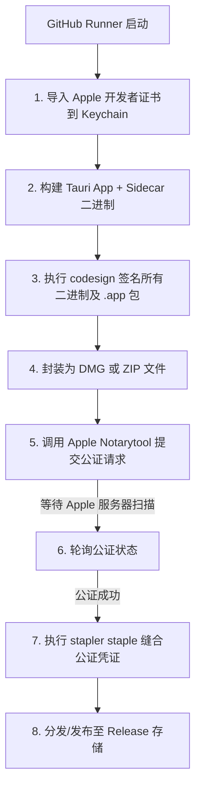

# Slash 桌面端分发、全局热更新与 macOS 签名公证设计方案

本文档固化了关于 **Tauri 桌面端与 Sidecar 协同全局热更新** 以及 **macOS 平台代码签名与公证 (Notarization)** 两项待办任务的技术选型与路线设计。这两项任务将在核心 Bug 回归与稳定性测试收敛后，作为发布 CD/CD 阶段的最终任务执行。

---

## 任务一：Desktop 客户端与 Sidecar 协同全局热更新

### 1. 技术选型：Tauri Native Updater
摒弃单独对 Python Sidecar 执行二进制替换的“碎片化热更新”方案，升级为**“整包自适应热更新”**。利用 Tauri 原生的自动更新机制，确保客户端逻辑（JS/Rust）与 Sidecar（Python 核心）的版本强一致性。

### 2. 具体待办开发内容
- **前端 (Settings Panel UI)**：
  - 在 `Settings -> Advanced` 面板增加 **“检查更新 (Check for Updates)”** 按钮。
  - 实现检测状态反馈（检测中、已是最新版本、发现新版本 `vX.Y.Z`）。
  - 设计毛玻璃质感的更新引导弹窗（包含更新说明、进度条、以及“重启并应用”按钮）。
- **后端 (Tauri Config & Cargo)**：
  - 在 `src-tauri/tauri.conf.json` 中激活 `plugins -> updater` 模块。
  - 配置 Ed25519 签名公证公钥（用于校验下载包的防篡改完整性）。
  - 设置检测端点：指向 CDN 静态配置文件（如 `https://cdn.slash.app/update.json`）或 GitHub Release API。

---

## 任务二：macOS 平台代码签名与公证 (Code Signing & Notarization)

### 1. 目标与痛点
防止 macOS 在用户首次安装 Slash 磁盘镜像时，弹出 **“无法打开，因为无法确认开发者的身份”** 或 **“App 已损坏，你应该将它移到废纸篓”** 的安全拦截。

### 2. 签名与公证工作流 (CI/CD Pipeline)
在 `.github/workflows/release.yml` 的 GitHub Actions 运行器中集成 Apple 证书签发与公证服务：

### 3. 具体开发配置待办
- **证书管理**：
  - 在 App Store Connect 申请 `Developer ID Application` 证书，导出为 `.p12` 格式，加密存储于 GitHub Secrets 中。
  - 创建专用 App Store Connect API Key，配置 `APPLE_API_ISSUER`、`APPLE_API_KEY_ID` 和 `APPLE_API_KEY` 环境变量。
- **Entitlements 配置**：
  - 编写 `Entitlements.plist` 文件，向 macOS 声明应用权限：
    - `com.apple.security.files.user-selected.read-write`：允许用户读写选择的笔记目录。
    - `com.apple.security.device.audio-input` / `com.apple.security.device.camera`：多媒体采集权限。
    - **特别关键**：`com.apple.security.cs.allow-unsigned-executable-memory` 与 `com.apple.security.cs.disable-library-validation`：**必须开启**，以允许主程序调起 Python Sidecar 独立进程并进行进程间通信。
