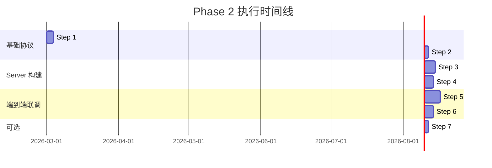

# Slash Team Edition: Phase 2 (Server & Sync) 详细实施方案

> **文档版本**: 1.0  
> **日期**: 2026-03-01  
> **前置条件**: Phase 1 (Monorepo Migration) ✅ 已完成 + Bug 修复轮已稳定

---

## 0. Phase 1 完成度评估与 Phase 2 启动条件

### Phase 1 已完成事项 ✅

| Step | 内容 | 状态 |
|------|------|------|
| Step 1 | Monorepo 根基盘 (`pnpm-workspace.yaml` + 根 `Cargo.toml`) | ✅ 已就位 |
| Step 2 | 物理搬家 (`apps/desktop/` 包含完整 src + src-tauri) | ✅ 已完成 |
| Step 3 | `@slash/shared-types` 前端类型包 | ✅ 已创建并挂载 |
| Step 4 | `slash-core` Rust 共享算法包 (hash, JSON提取, 文件名消毒等) | ✅ 已抽离 141 行纯函数 |
| Step 5 | `@slash/editor-core` TipTap 编辑器核心包 | ⚠️ 已结构搬家，但解耦未完成 |

### Phase 1 遗留债务（不阻塞 Phase 2 启动）

| 项目 | 说明 | 紧迫度 |
|------|------|--------|
| `js-editor-core` Tauri 残留耦合 | 6处直接 `import { invoke } from '@tauri-apps/api/core'`（WikiLink suggestion/NodeView、SectionSuggestion、DrawingService），Phase 1 Step 5 要求"彻底切断原生 Tauri 依赖"尚未完成 | **低** — 不影响 Server 构建，可在 Phase 3 (Mobile) 前解决 |
| `slash-sync-proto` 空骨架 | 仅含默认 `add()` 测试函数，协议结构未定义 | **中** — Phase 2 Step 2 将填充此包 |
| `Fix-list.md` Bug 清单 | 多级列表回车报错、数学公式拷贝失败等编辑器体验问题 **均已修复** (BUG-006~020 全部 Completed & Verified) | ✅ 已清零 |

### 启动评估结论

> **✅ 可以启动 Phase 2。**  
> - Monorepo 基础设施已全面就位，Cargo Workspace 挂载正常运转
> - 个人客户端经过 BUG-006~020 大规模修复后基本稳定
> - Phase 1 遗留的 `js-editor-core` Tauri 耦合不影响 Server 端开发（编辑器包只被 Desktop 消费，Server 不需要它）
> - `slash-sync-proto` 的填充正是 Phase 2 的核心任务之一

---

## 1. Phase 2 核心目标

对应 PRD §5 阶段二：**建立对话与云盘级同步 (M2 - Slash Server Community 先行)**

三大里程碑：
1. **构建 Rust Axum 空壳 Server**，打通 JWT Auth 与多租户雏形
2. **Slash Sync Protocol 第一次验证**：Personal Space 增量同步
3. **基础设施对接**：S3/Minio 附件存储 + (可选) Python Sidecar 文件解析

---

## 2. 整体架构蓝图

```text
slash/
├── apps/
│   ├── desktop/                  # [现存] Tauri 桌面端
│   │   ├── src/                  # React 前端
│   │   └── src-tauri/            # Rust 后端 (Tauri Commands)
│   │       └── Cargo.toml        → 依赖 slash-core, slash-sync-proto
│   │
│   ├── server/                   # [NEW] Rust Axum 服务端
│   │   ├── Cargo.toml            → 依赖 slash-core, slash-sync-proto
│   │   ├── src/
│   │   │   ├── main.rs           # Axum 启动入口
│   │   │   ├── config.rs         # 环境配置 (PORT, DB_URL, JWT_SECRET)
│   │   │   ├── auth/             # JWT 鉴权模块
│   │   │   │   ├── mod.rs
│   │   │   │   ├── jwt.rs        # JWT 签发/验证
│   │   │   │   └── middleware.rs # Axum 鉴权中间件
│   │   │   ├── routes/           # API 路由层
│   │   │   │   ├── mod.rs
│   │   │   │   ├── auth.rs       # POST /api/register, /api/login
│   │   │   │   ├── sync.rs       # POST /api/sync/negotiate, /api/sync/push, /api/sync/pull
│   │   │   │   └── health.rs     # GET /api/health
│   │   │   ├── models/           # 数据模型 (User, SyncState)
│   │   │   ├── db/               # PostgreSQL 连接池 + 迁移
│   │   │   └── sync/             # 同步协议服务端实现
│   │   │       ├── mod.rs
│   │   │       ├── negotiator.rs # Hash 差异协商引擎
│   │   │       └── storage.rs    # S3/Minio 对接层
│   │   └── migrations/           # SQL 迁移文件
│   │
│   └── python-sidecar/           # [NEW - 可选] MarkItDown 解析容器
│       ├── Dockerfile
│       ├── requirements.txt
│       └── app/
│           └── main.py           # FastAPI 空壳
│
├── packages/
│   ├── slash-core/               # [现存] Rust 纯算法共享包
│   │   └── src/lib.rs            # + 新增: Merkle Tree Hash, File Manifest
│   ├── slash-sync-proto/         # [现存骨架 → 填充] 同步协议定义
│   │   └── src/lib.rs            # SyncRequest/Response, LogicalClock, FileManifest
│   ├── js-editor-core/           # [现存] TipTap 编辑器核心
│   └── js-shared-types/          # [现存] TS 类型共享
│       └── src/index.ts          # + 新增: SyncStatus, AuthToken 等前端类型
```

---

## 3. 分步实施方案

### Step 1: 定义同步协议 (slash-sync-proto) 🏗️

**目标**：填充 `packages/slash-sync-proto`，定义端云共享的数据合约。

**数据结构清单**：

```rust
// packages/slash-sync-proto/src/lib.rs

use serde::{Deserialize, Serialize};

/// 文件级元信息（端云共享的最小传输单元）
#[derive(Debug, Clone, Serialize, Deserialize)]
pub struct FileManifest {
    pub relative_path: String,      // "02_Areas/Logic/Aristotle.md"
    pub content_hash: String,       // SHA-256 前16位 (复用 slash-core::calculate_content_hash)
    pub size: u64,
    pub mtime: i64,                 // Unix timestamp
    pub logical_clock: u64,         // Lamport 逻辑时钟 (递增)
}

/// 目录级 Merkle Hash（用于快速差异检测）
#[derive(Debug, Clone, Serialize, Deserialize)]
pub struct DirectoryHash {
    pub path: String,               // "02_Areas/Logic/"
    pub merkle_hash: String,        // 子文件 hash 聚合
    pub file_count: u32,
}

/// 同步协商请求 (Client → Server)
#[derive(Debug, Serialize, Deserialize)]
pub struct SyncNegotiateRequest {
    pub vault_id: String,
    pub space_type: SpaceType,
    pub directory_hashes: Vec<DirectoryHash>,
    pub client_clock: u64,
}

/// 同步协商响应 (Server → Client)
#[derive(Debug, Serialize, Deserialize)]
pub struct SyncNegotiateResponse {
    pub server_clock: u64,
    pub client_needs: Vec<String>,  // 客户端需要从服务器拉取的路径
    pub server_needs: Vec<String>,  // 服务器需要客户端推送的路径
    pub conflicts: Vec<ConflictInfo>,
}

/// 冲突信息
#[derive(Debug, Serialize, Deserialize)]
pub struct ConflictInfo {
    pub path: String,
    pub client_hash: String,
    pub server_hash: String,
    pub client_clock: u64,
    pub server_clock: u64,
}

/// 空间类型
#[derive(Debug, Clone, Serialize, Deserialize)]
pub enum SpaceType {
    Personal,
    Team(String), // team_id
}

/// 文件推送载荷 (单文件)
#[derive(Debug, Serialize, Deserialize)]
pub struct FilePushPayload {
    pub manifest: FileManifest,
    pub content: Vec<u8>,           // 文件二进制内容
}

/// 同步状态 (前端展示用)
#[derive(Debug, Clone, Serialize, Deserialize)]
pub enum SyncStatus {
    Idle,
    Negotiating,
    Syncing { progress: f32 },
    Conflict { paths: Vec<String> },
    Error(String),
    Offline,
}
```

**验收标准**：
- `cargo check` 通过
- Desktop (`apps/desktop/src-tauri`) 和将来的 Server 都能 `use slash_sync_proto::*`

---

### Step 2: 增强共享算法包 (slash-core) 🧮

**目标**：在 `packages/slash-core` 中新增 Merkle Tree 和 File Manifest 构建能力。

**新增函数**：

```rust
// packages/slash-core/src/lib.rs (追加)

/// 构建目录的 Merkle Hash
/// 输入：该目录下所有文件的 content_hash（已排序）
/// 输出：聚合 hash
pub fn calculate_directory_hash(file_hashes: &mut Vec<&str>) -> String {
    file_hashes.sort();
    let combined = file_hashes.join("|");
    calculate_content_hash(&combined)
}

/// 扫描目录生成 FileManifest 列表
/// 注意：此函数依赖 std::fs，仅用于端侧和服务端本地扫描
pub fn scan_directory_manifests(root: &std::path::Path) -> Vec<FileManifestBasic> {
    // walkdir 扫描 + 计算 hash
}

#[derive(Debug, Clone)]
pub struct FileManifestBasic {
    pub relative_path: String,
    pub content_hash: String,
    pub size: u64,
    pub mtime: i64,
}
```

**新增依赖**：`walkdir = "2"` (已在 desktop Cargo.toml 中使用)

**验收标准**：`cargo test` 通过，包含对 `calculate_directory_hash` 的单元测试

---

### Step 3: 构建 Axum Server 空壳 (apps/server) 🖥️

**目标**：创建最小可验证的 Rust HTTP Server。

#### 3a. 项目初始化

```bash
# 在 apps/server/ 下创建
cargo init --name slash-server apps/server
```

更新根 `Cargo.toml`：
```toml
[workspace]
members = [
    "apps/desktop/src-tauri",
    "apps/server",                # NEW
    "packages/slash-core",
    "packages/slash-sync-proto"
]
resolver = "2"
```

#### 3b. 核心依赖

```toml
# apps/server/Cargo.toml
[dependencies]
axum = "0.8"
tokio = { version = "1", features = ["full"] }
serde = { version = "1", features = ["derive"] }
serde_json = "1"
tower-http = { version = "0.6", features = ["cors", "trace"] }
tracing = "0.1"
tracing-subscriber = "0.3"
jsonwebtoken = "9"
argon2 = "0.5"                    # 密码哈希
sqlx = { version = "0.8", features = ["runtime-tokio", "postgres", "migrate"] }
uuid = { version = "1", features = ["v4"] }
dotenvy = "0.15"

# 工作区共享包
slash-core = { path = "../../packages/slash-core" }
slash-sync-proto = { path = "../../packages/slash-sync-proto" }
```

#### 3c. 最小 Server 结构

```rust
// apps/server/src/main.rs
#[tokio::main]
async fn main() {
    tracing_subscriber::init();
    
    let app = Router::new()
        .route("/api/health", get(health))
        .route("/api/auth/register", post(register))
        .route("/api/auth/login", post(login))
        .nest("/api/sync", sync_routes())  // JWT 保护
        .layer(CorsLayer::permissive());
    
    let addr = "0.0.0.0:3721";
    axum::serve(listener, app).await.unwrap();
}
```

#### 3d. PostgreSQL 数据库 Schema (Server 端)

```sql
-- apps/server/migrations/001_init.sql

CREATE TABLE users (
    id UUID PRIMARY KEY DEFAULT gen_random_uuid(),
    email TEXT NOT NULL UNIQUE,
    password_hash TEXT NOT NULL,
    display_name TEXT,
    created_at TIMESTAMPTZ DEFAULT NOW(),
    updated_at TIMESTAMPTZ DEFAULT NOW()
);

CREATE TABLE vaults (
    id UUID PRIMARY KEY DEFAULT gen_random_uuid(),
    owner_id UUID NOT NULL REFERENCES users(id),
    name TEXT NOT NULL,
    space_type TEXT NOT NULL DEFAULT 'personal',  -- 'personal' / 'team'
    created_at TIMESTAMPTZ DEFAULT NOW()
);

CREATE TABLE file_states (
    id UUID PRIMARY KEY DEFAULT gen_random_uuid(),
    vault_id UUID NOT NULL REFERENCES vaults(id),
    relative_path TEXT NOT NULL,
    content_hash TEXT NOT NULL,
    size BIGINT NOT NULL,
    logical_clock BIGINT NOT NULL DEFAULT 0,
    updated_at TIMESTAMPTZ DEFAULT NOW(),
    UNIQUE(vault_id, relative_path)
);

CREATE TABLE sync_logs (
    id UUID PRIMARY KEY DEFAULT gen_random_uuid(),
    vault_id UUID NOT NULL REFERENCES vaults(id),
    user_id UUID NOT NULL REFERENCES users(id),
    action TEXT NOT NULL,            -- 'push', 'pull', 'conflict_resolve'
    file_count INTEGER NOT NULL,
    created_at TIMESTAMPTZ DEFAULT NOW()
);
```

**验收标准**：
- `cargo build -p slash-server` 通过
- `curl http://localhost:3721/api/health` 返回 `{ "status": "ok" }`

---

### Step 4: JWT 鉴权系统 🔐

**目标**：实现完整的注册/登录/Token 刷新流程。

#### API 设计

| 方法 | 路径 | 说明 | 鉴权 |
|------|------|------|------|
| POST | `/api/auth/register` | 注册 (email + password) | 无 |
| POST | `/api/auth/login` | 登录，返回 JWT | 无 |
| POST | `/api/auth/refresh` | 刷新 Token | Bearer |
| GET | `/api/auth/me` | 获取当前用户信息 | Bearer |

#### JWT 载荷

```rust
#[derive(Debug, Serialize, Deserialize)]
pub struct Claims {
    pub sub: String,          // user_id
    pub email: String,
    pub exp: usize,           // 过期时间 (24h)
    pub iat: usize,
}
```

#### 桌面端集成

在 `apps/desktop` 前端新增：
- `src/core/auth/AuthService.ts` — 封装登录/注册 API 调用
- `src/core/auth/AuthStore.ts` (Zustand) — Token 持久化到 `keyring`（复用现有 `keyring` 依赖）
- `src/features/settings/ServerSettings.tsx` — Server URL 配置 UI

**验收标准**：
- 注册 → 登录 → 获取 JWT → 带 Token 调 `/api/auth/me` 返回用户信息
- Token 过期后返回 401

---

### Step 5: Slash Sync Protocol 端到端验证 🔄

**目标**：Personal Space 的单向同步验证（Desktop → Server）。

#### 同步流程 (三步握手)

```
┌──────────┐                        ┌──────────┐
│  Desktop │                        │  Server  │
└────┬─────┘                        └────┬─────┘
     │                                   │
     │  1. POST /api/sync/negotiate      │
     │  { directory_hashes, clock }      │
     │──────────────────────────────────>│
     │                                   │
     │  { client_needs, server_needs }   │
     │<──────────────────────────────────│
     │                                   │
     │  2. POST /api/sync/push           │
     │  { files[] } (server_needs)       │
     │──────────────────────────────────>│
     │                                   │
     │  3. POST /api/sync/pull           │
     │  { paths[] } (client_needs)       │
     │──────────────────────────────────>│
     │                                   │
     │  { files[] }                      │
     │<──────────────────────────────────│
```

#### 桌面端新增 (src-tauri)

在 `apps/desktop/src-tauri/src/commands/` 新增 `sync.rs`：

```rust
#[tauri::command]
pub async fn sync_vault(
    db_state: State<'_, DbStateWrapper>,
    auth_state: State<'_, AuthState>,   // NEW: Server URL + JWT
) -> Result<SyncResult, String> {
    // 1. 扫描本地目录生成 manifest
    // 2. 调用 slash_core::calculate_directory_hash 构建 Merkle tree
    // 3. POST /api/sync/negotiate
    // 4. 根据响应执行 push/pull
    // 5. 更新本地 logical_clock
}
```

#### UI 集成

- 侧边栏底部新增同步状态指示器 (使用 `SyncStatus` 枚举)
- 手动同步按钮 + 自动同步定时器 (5分钟间隔)

**验收标准**：
- 本地新建笔记 → 触发同步 → Server `file_states` 表记录写入
- Server 上有更新 → 触发同步 → 本地文件更新
- 完全断网时，UI 显示 `Offline` 状态，操作入队 `queue`

---

### Step 6: S3/Minio 附件存储对接 📦

**目标**：Images/Assets 的云端存储，替代纯本地 `.slash/assets` 模式。

#### Server 端

```rust
// apps/server/src/sync/storage.rs
pub struct ObjectStorage {
    client: aws_sdk_s3::Client,
    bucket: String,
}

impl ObjectStorage {
    pub async fn upload_asset(&self, vault_id: &str, path: &str, data: &[u8]) -> Result<String>;
    pub async fn download_asset(&self, vault_id: &str, path: &str) -> Result<Vec<u8>>;
    pub async fn delete_asset(&self, vault_id: &str, path: &str) -> Result<()>;
}
```

#### Desktop 端适配

修改 `AssetService` 添加双写策略：
1. **本地优先**：asset 先落盘到 `.slash/assets/`（现有行为不变）
2. **后台上传**：同步时将 assets 增量推送至 S3

**验收标准**：
- 带图片的笔记同步后，图片可通过 Server 的 S3 URL 访问
- 断网时图片仍可通过本地路径正常显示

---

### Step 7: (可选) Python Sidecar 准备 🐍

**目标**：最小可用的文档解析服务。

```text
apps/python-sidecar/
├── Dockerfile
├── requirements.txt        # fastapi, uvicorn, markitdown
└── app/
    └── main.py             # POST /parse (file → markdown)
```

此步骤优先级最低，仅搭建空壳和 Docker 环境，不阻塞主线。

---

## 4. Desktop 端 SQLite Schema 扩展

为支持同步状态追踪，需要在现有 `schema.sql` 基础上新增：

```sql
-- 新增列 (notes 表)
ALTER TABLE notes ADD COLUMN logical_clock INTEGER DEFAULT 0;
ALTER TABLE notes ADD COLUMN sync_status TEXT DEFAULT 'local';  -- 'local', 'synced', 'pending', 'conflict'
ALTER TABLE notes ADD COLUMN vault_id TEXT;                      -- 关联远程 vault

-- 新增表：同步队列 (离线操作缓存)
CREATE TABLE IF NOT EXISTS sync_queue (
    id INTEGER PRIMARY KEY AUTOINCREMENT,
    operation TEXT NOT NULL,          -- 'create', 'update', 'delete'
    relative_path TEXT NOT NULL,
    content_hash TEXT,
    payload BLOB,                     -- 文件内容 (create/update 时)
    created_at INTEGER DEFAULT (unixepoch()),
    retry_count INTEGER DEFAULT 0
);

-- 新增表：服务器连接配置
CREATE TABLE IF NOT EXISTS server_config (
    id INTEGER PRIMARY KEY,
    server_url TEXT,
    vault_id TEXT,
    last_sync_at INTEGER,
    last_server_clock INTEGER DEFAULT 0
);
```

**迁移策略**：使用已有的 `schema_version` 表，版本号递增执行 `ALTER TABLE`。

---

## 5. 前端类型扩展 (js-shared-types)

```typescript
// packages/js-shared-types/src/index.ts (追加)

export interface AuthToken {
  access_token: string;
  token_type: 'Bearer';
  expires_at: number;
}

export interface UserProfile {
  id: string;
  email: string;
  display_name?: string;
}

export interface SyncStatusInfo {
  status: 'idle' | 'negotiating' | 'syncing' | 'conflict' | 'error' | 'offline';
  progress?: number;
  conflict_paths?: string[];
  error_message?: string;
  last_sync_at?: number;
}

export interface ServerConfig {
  server_url: string;
  vault_id?: string;
  connected: boolean;
}
```

---

## 6. 执行顺序与并行性



**预计总工期**：3-4 周（一人全职）

---

## 7. 风险与缓解

| 风险 | 影响 | 缓解策略 |
|------|------|----------|
| PostgreSQL 部署复杂度 | 开发环境搭建成本 | 提供 `docker-compose.yml`，含 PG + Minio 一键启动 |
| 同步冲突处理不完善 | 数据丢失 | Phase 2 先实现 "Last-Write-Wins" 策略，Phase 3 再实现完整 Diff 合并 |
| Axum + SQLx 生态学习曲线 | 开发效率 | 先用最简 Router 跑通，逐步添加中间件 |
| `js-editor-core` Tauri 残留耦合 | 未来 Mobile 端复用受阻 | 本阶段不阻塞，Phase 3 (Mobile) 前必须彻底解耦 |
| 大文件同步性能 | 超时/内存溢出 | 限制单文件 ≤ 50MB，大附件走 S3 分片上传 |

---

## 8. 验证计划

### 8.1 自动化测试

```bash
# 1. Cargo workspace 全量编译
cargo build --workspace

# 2. slash-sync-proto 单元测试
cargo test -p slash-sync-proto

# 3. slash-core 新增函数测试
cargo test -p slash-core

# 4. Server 集成测试 
cargo test -p slash-server

# 5. Desktop 构建验证
cd apps/desktop && pnpm dev
cd apps/desktop/src-tauri && cargo check
```

### 8.2 手动端到端验证

1. **启动基础设施**：`docker-compose up -d`（PostgreSQL + Minio）
2. **启动 Server**：`cargo run -p slash-server`
3. **桌面端注册/登录**：
   - 在 Settings 页面输入 Server URL (`http://localhost:3721`)
   - 注册新账号并登录
   - 确认 JWT 存储到 keyring
4. **同步验证**：
   - 新建笔记 → 点击"同步" → 检查 Server DB 中 `file_states` 记录
   - 在 Server DB 中修改一条记录的 hash → 再次同步 → 确认桌面端拉取更新
5. **离线降级**：
   - 断开网络 → 新建笔记 → 确认 `sync_queue` 写入
   - 恢复网络 → 确认自动同步执行

### 8.3 回归验证

Phase 2 所有改动完成后，必须验证以下个人客户端功能未受影响：
- 笔记 CRUD（创建/读取/编辑/删除）
- Markdown 序列化完整性
- WikiLink 导航
- AI 功能（GhostLink、Summary）
- 搜索功能（FTS + 语义）
- Task 系统
- 侧边栏文件树操作

---

## 9. 不做的事 (明确边界)

以下功能属于 **Phase 3 (M3)** 范畴，本阶段 **不涉及**：

- ❌ Team Vault 的 RBAC 权限系统
- ❌ PR (Pull Request) 审阅流程
- ❌ TipTap Red-Green Diff 对比渲染
- ❌ 多人协作的冲突合并 UI
- ❌ 目录级动态授权
- ❌ 移动端开发
- ❌ Lemon Squeezy 商业化集成
